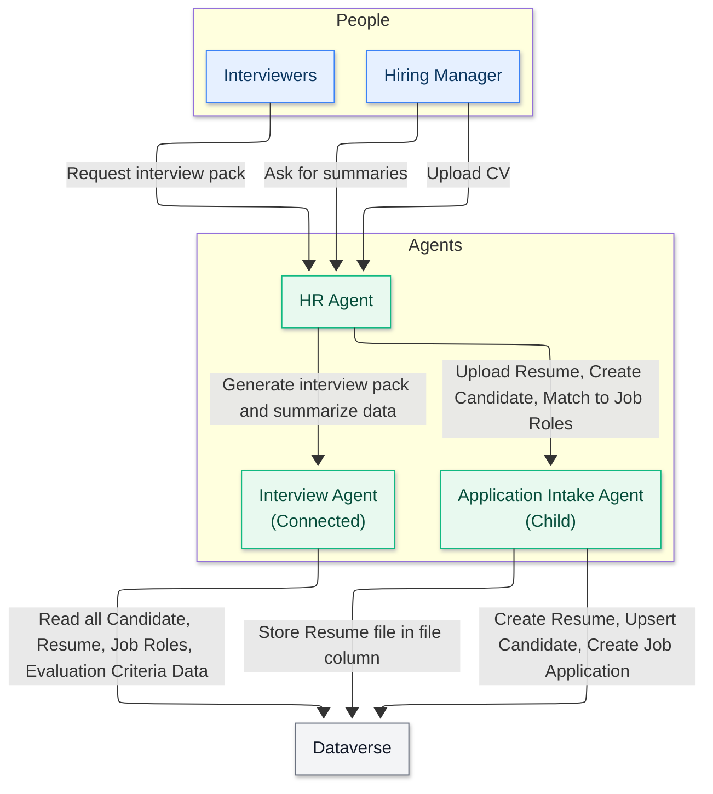

<div class="info-box note" markdown="1">
**원문 번역 게시물** — 이 글은 [Copilot Studio Agent Academy](https://microsoft.github.io/agent-academy/)의 원문 [🚨 Mission 03: Multi-Agent Systems](https://microsoft.github.io/agent-academy/operative/03-multi-agent/)을 한글로 옮긴 것입니다. 원문 표현이 우선합니다.
</div>

🎥 **워크스루 영상 보기**

<figure class="screenshot">
  <a href="https://www.youtube.com/watch?v=X-nyqdk6tcc" target="_blank" rel="noopener">
    
  </a>
</figure>

## 🎯 미션 개요

다시 오신 것을 환영합니다, Agent. Mission 01에서는 채용 워크플로를 관리하기 위한 탄탄한 기반으로 메인 Hiring Agent를 구축했습니다. 하지만 하나의 agent만으로는 할 수 있는 일에 한계가 있습니다.

이번 과제의 이름은 **Operation Symphony**입니다. 단일 agent를 **멀티 에이전트 시스템**으로 전환하는 작업으로, 복잡한 채용 과제를 처리하기 위해 함께 동작하는 전문 agent 팀을 오케스트레이션하게 됩니다. 혼자 일하는 운영자에서 전문 태스크 포스를 지휘하는 역할로 업그레이드한다고 생각하면 됩니다.

교향악단에서 각 연주자가 완벽한 조화를 이루며 자신의 파트를 연주하듯, 기존 Hiring Agent에 두 명의 핵심 전문가를 추가하게 됩니다. 하나는 이력서를 자동 처리하는 Application Intake Agent이고, 다른 하나는 포괄적인 면접 자료를 만드는 Interview Prep Agent입니다. 이 agent들은 메인 orchestrator 아래에서 매끄럽게 함께 동작합니다.

<div class="info-box note" markdown="1">
**참고** — Copilot Studio 화면이 이 강의의 스크린샷과 다르게 보인다면, 오른쪽 위의 **New Experience**를 꺼서 여기에서 사용하는 **classic experience**로 전환하세요.
</div>

## 🔎 학습 목표

이번 미션에서는 다음을 배우게 됩니다.

1. **child agents**와 **connected agents**를 언제 사용해야 하는지
1. 확장 가능한 **multi-agent architectures**를 설계하는 방법
1. 집중된 작업을 위한 **child agents** 만들기
1. agents 간 **communication patterns** 수립하기
1. Application Intake Agent와 Interview Prep Agent 구축하기

## 🧠 connected agents란 무엇인가요?

Copilot Studio에서는 단일하고 거대한 agent만 만드는 데 그치지 않습니다. 복잡한 워크플로를 처리하기 위해 함께 동작하는 전문 agent들의 네트워크, 즉 **멀티 에이전트 시스템**을 만들 수 있습니다.

현실의 조직처럼 생각해 보세요. 한 사람이 모든 일을 처리하는 대신, 특정 작업에 뛰어난 전문가들이 필요할 때 협업하는 방식입니다.

### 멀티 에이전트 시스템이 중요한 이유

- **확장성:** 각 agent는 서로 다른 팀이 독립적으로 개발, 테스트, 유지 관리할 수 있습니다.
- **전문화:** agents는 자신이 가장 잘하는 일에 집중할 수 있습니다. 예를 들어 하나는 데이터 처리, 다른 하나는 사용자 상호작용, 또 다른 하나는 의사결정을 맡을 수 있습니다.
- **유연성:** agents를 조합해 사용할 수 있고, 여러 프로젝트에서 재사용할 수 있으며, 시스템을 점진적으로 발전시킬 수 있습니다.
- **유지보수성:** 한 agent의 변경이 반드시 다른 agent에 영향을 주는 것은 아니므로 업데이트가 더 안전하고 쉬워집니다.

### 실제 예시: 채용 프로세스

채용 워크플로를 생각해 보면, 여러 agent가 다음과 같은 책임을 나누어 함께 일할 수 있습니다.

- **이력서 접수**에는 문서 파싱과 데이터 추출 역량이 필요합니다.
- **평가 점수 산정**에는 지원자의 이력서를 평가하고 직무 요건과 매칭하는 능력이 필요합니다.
- **면접 준비**에는 지원자 적합성에 대한 깊이 있는 추론이 필요합니다.
- **지원자 커뮤니케이션**에는 공감력 있는 소통 능력이 필요합니다.

이 모든 역량을 처리하려는 하나의 거대한 agent를 만드는 대신, 각 영역별로 전문 agent를 만들고 이를 함께 오케스트레이션할 수 있습니다.

## 🔗 Child agents와 connected agents: 핵심 차이

Copilot Studio는 멀티 에이전트 시스템을 구축하는 두 가지 방법을 제공하며, 각각 고유한 사용 사례가 있습니다.

### ↘️ Child agents

Child agents는 메인 agent 내부에서 동작하는 **가벼운 전문가**입니다. 같은 부서 안의 전문 팀처럼 생각하면 됩니다.

#### 핵심 기술 세부 사항

- Child agents는 parent agent 내부에 존재하며 단일 구성 페이지를 가집니다.
- Tools와 Knowledge는 **parent** agent에 저장되지만, child agent에 "Available to" 되도록 구성됩니다.
- Child agents는 parent agent의 **topics를 공유**합니다. Topics는 child agent instructions에서 참조할 수 있습니다.
- Child agents는 **별도 게시가 필요 없습니다**. 생성되면 parent agent 내부에서 자동으로 사용할 수 있습니다. 덕분에 parent와 child agent 변경을 **동일한 공유 작업 영역**에서 수행할 수 있어 테스트가 더 쉬워집니다.

#### 다음과 같은 경우 child agents를 사용하세요

- 하나의 팀이 전체 solution을 관리할 때
- tools와 knowledge를 논리적으로 하위 agent로 구성하고 싶을 때
- 각 agent마다 별도의 인증이나 배포가 필요 없을 때
- agents를 별도로 게시하거나 독립적으로 사용할 필요가 없을 때
- 여러 solution에서 agent를 재사용할 필요가 없을 때

**예시:** 다음 child agents를 가진 IT 헬프데스크 agent

- 비밀번호 재설정 절차
- 하드웨어 문제 해결
- 소프트웨어 설치 가이드

### 🔀 Connected agents

Connected agents는 메인 agent가 협업할 수 있는 **완전한 독립형 agent**입니다. 하나의 프로젝트에서 함께 일하는 서로 다른 부서처럼 생각하면 됩니다.

#### 핵심 기술 세부 사항

- Connected agents는 **자체 topics**와 대화 흐름을 가집니다. 자체 설정, 로직, 배포 수명 주기로 독립적으로 동작합니다.
- Connected agents는 다른 agents에 추가되어 사용되기 전에 **반드시 게시되어야 합니다**.
- 테스트 중에는 calling agent가 변경 사항을 사용하기 전에 connected agent 변경 사항을 먼저 게시해야 합니다.

#### 다음과 같은 경우 connected agents를 사용하세요

- 여러 팀이 서로 다른 agents를 독립적으로 개발하고 유지 관리할 때
- Agents에 자체 설정, 인증, 배포 채널이 필요할 때
- 각 agent에 대해 독립적인 애플리케이션 수명주기 관리(ALM)로 agents를 따로 게시하고 유지 관리하고 싶을 때
- 여러 solution에서 agents를 재사용해야 할 때

**예시:** 다음에 연결되는 고객 서비스 시스템

- 재무 팀이 유지 관리하는 별도의 청구 agent
- 제품 팀이 유지 관리하는 별도의 기술 지원 agent
- 운영 팀이 유지 관리하는 별도의 반품 agent

<div class="info-box note" markdown="1">
**팁** — 두 접근 방식을 함께 사용할 수도 있습니다. 예를 들어 메인 agent가 다른 팀의 외부 agents에 연결하면서도, 내부 전문 작업을 위해 자체 child agents를 가질 수 있습니다.
</div>

## 🎯 멀티 에이전트 아키텍처 패턴

멀티 에이전트 시스템을 설계할 때는 agent들이 상호작용하는 방식에 따라 몇 가지 패턴이 나타납니다.

| 패턴 | 설명 | 가장 적합한 경우 |
| --- | --- | --- |
| **Hub and Spoke** | 메인 orchestrator agent가 여러 전문 agent를 조율합니다. orchestrator는 사용자 상호작용을 처리하고 작업을 child agents 또는 connected agents에 위임합니다. | 하나의 agent가 전문 작업을 조율하는 복잡한 워크플로 |
| **Pipeline** | agents가 작업을 순차적으로 다음 agent로 전달하며, 각 단계에서 가치를 더한 뒤 다음 단계로 넘깁니다. | 지원서 처리처럼 선형적인 프로세스(intake -> screening -> interview -> decision) |
| **Collaborative** | agents가 동일한 문제의 서로 다른 측면을 동시에 함께 다루며, 컨텍스트와 결과를 공유합니다. | 여러 관점이나 전문성이 필요한 복잡한 분석 |

<div class="info-box note" markdown="1">
**팁** — 위 패턴 중 둘 이상을 조합한 하이브리드 형태를 사용할 수도 있습니다.
</div>

## 💬 Agent 간 커뮤니케이션과 컨텍스트 공유

Agents가 함께 일할 때는 정보를 효과적으로 공유해야 합니다. Copilot Studio에서는 이를 다음과 같이 지원합니다.

### 대화 기록

기본적으로 메인 agent가 child agent 또는 connected agent를 호출할 때 **conversation history**를 함께 전달할 수 있습니다. 이를 통해 전문 agent는 사용자가 무엇을 논의해 왔는지에 대한 전체 컨텍스트를 갖게 됩니다.

보안이나 성능상의 이유로 이 기능을 끌 수도 있습니다. 예를 들어 전문 agent가 전체 대화 컨텍스트 없이 특정 작업만 처리하면 되는 경우입니다. 이는 **data leakage**를 방지하는 좋은 방법이 될 수 있습니다.

### 명시적 지시

메인 agent는 child agent 또는 connected agent에 **구체적인 instructions**를 줄 수 있습니다. 예를 들어 "이 이력서를 처리하고 Senior Developer 역할에 대한 기술 요약을 제공해"와 같은 방식입니다.

### 반환 값

Agents는 calling agent에 구조화된 정보를 반환할 수 있으므로, 메인 agent는 이후 단계에서 그 정보를 활용하거나 다른 agents와 공유할 수 있습니다.

### Dataverse 통합

더 복잡한 시나리오에서는 agents가 **Dataverse** 또는 다른 데이터 저장소를 통해 정보를 공유할 수 있어, 여러 상호작용에 걸쳐 지속되는 컨텍스트 공유가 가능해집니다.

## ↘️ Child agent: Application Intake Agent

이제 멀티 에이전트 채용 시스템을 구축해 보겠습니다. 첫 번째 전문가는 **Application Intake Agent**로, 들어오는 이력서와 지원자 정보를 처리하는 child agent입니다.



### 🤝 Application Intake Agent의 책임

- 대화형 채팅에서 제공된 PDF의 **이력서 내용을 파싱**합니다. (향후 미션에서는 이력서를 자율적으로 처리하는 방법을 배웁니다.)
- **구조화된 데이터**(이름, 기술, 경력, 학력)를 추출합니다.
- 자격 요건과 자기소개 메시지를 기준으로 **지원자를 공고 역할에 매칭**합니다.
- 이후 처리를 위해 **지원자 정보를 Dataverse에 저장**합니다.
- 동일한 지원자를 두 번 만들지 않도록 **중복 지원을 제거**하고, 이력서에서 추출한 이메일 주소를 사용해 기존 레코드와 매칭합니다.

### ⭐ 이것이 child agent여야 하는 이유

Application Intake Agent가 child agent로 적합한 이유는 다음과 같습니다.

- 문서 처리와 데이터 추출에 특화되어 있습니다.
- 별도 게시가 필요하지 않습니다.
- 같은 팀이 관리하는 전체 채용 solution의 일부입니다.
- 새 이력서 수신이라는 특정 트리거에 집중하며 Hiring Agent에서 호출됩니다.

## 🔀 Connected agent: Interview Prep Agent

두 번째 전문가는 **Interview Prep Agent**입니다. 이 connected agent는 포괄적인 면접 자료를 만들고 지원자 응답을 평가하는 데 도움을 줍니다.

### 🤝 Interview Prep Agent의 책임

- 회사 정보, 역할 요구사항, 평가 기준을 포함한 **interview pack 생성**
- 특정 역할과 지원자 배경에 맞춘 **면접 질문 생성**
- 이해관계자 커뮤니케이션을 위해 직무 역할과 지원서에 대한 **일반 질문 응답**

### ⭐ 이것이 connected agent여야 하는 이유

Interview Prep Agent가 connected agent로 더 적합한 이유는 다음과 같습니다.

- 인재 확보 팀이 여러 채용 프로세스 전반에서 이를 독립적으로 사용하고자 할 수 있습니다.
- 면접 모범 사례와 평가 기준에 대한 자체 knowledge base가 필요합니다.
- 서로 다른 hiring manager가 자신의 팀에 맞게 동작을 커스터마이즈하고자 할 수 있습니다.
- 외부 채용뿐 아니라 내부 포지션에도 재사용될 수 있습니다.

## 🧪 실습 3.1 - Application Intake Agent 추가하기

이제 이론을 실제에 적용해 보겠습니다. 기존 Hiring Agent에 첫 번째 child agent를 추가해 봅시다.

### 이 미션을 완료하기 위한 사전 준비

이 미션을 완료하려면 다음이 필요합니다.

- **[Mission 01]({{ '/chapters/academy-operative-01-get-started/' | relative_url }})**을 완료하고 Hiring Agent를 준비해 두어야 합니다.

### 3.1.1 Solution 설정

1. Copilot Studio 안에서 왼쪽 탐색의 Tools 아래에 있는 줄임표(...)를 선택합니다.
1. **Solutions**를 선택합니다.

    <figure class="screenshot">
      
    </figure>

1. Operative solution을 찾은 다음, 그 옆의 **ellipsis (...)**를 선택하고 **Set preferred solution**을 고릅니다. 팝업 대화 상자에서 **Apply**를 선택합니다. 이렇게 하면 앞으로 수행하는 모든 작업이 이 solution에 추가됩니다.

    <figure class="screenshot">
      
    </figure>

### 3.1.2 Hiring Agent의 agent instructions 구성

1. Copilot Studio로 **이동**합니다. 오른쪽 위의 **Environment Picker**에서 환경이 선택되어 있는지 확인합니다.
1. Mission 01에서 만든 **Hiring Agent**를 엽니다.
1. agent의 **Overview** 탭에 있는 **Instructions** 섹션에서 **Edit**를 선택합니다.

    <figure class="screenshot">
      
    </figure>

    instructions 입력란에 다음 지침을 복사해 붙여 넣습니다.

    ```text
    You are the central orchestrator for the hiring process. You coordinate activities, provide summaries, and delegate work to specialized agents.
    ```

1. **Save**를 선택합니다.

    <figure class="screenshot">
      
    </figure>

1. 화면 오른쪽 위의 **Settings** 버튼을 선택합니다.

    <figure class="screenshot">
      
    </figure>

1. 페이지를 검토하고 다음 설정이 적용되어 있는지 확인합니다.

    | Setting | Value |
    | ------- | ----- |
    | Use generative AI orchestration for your agent's responses | **Yes** |
    | Deep Reasoning | **Off** |
    | Let other agents connect to and use this one | **On** |
    | Continue using retired models | **Off** |
    | Content Moderation | **Moderate** |
    | Collect user reactions to agent messages | **On** |
    | Use general knowledge | **Off** |
    | Use information from the Web | **Off** |
    | File uploads | **On** |
    | Code Interpreter | **Off** |

    <figure class="screenshot">
      
    </figure>

    <figure class="screenshot">
      
    </figure>

1. **Save**를 클릭합니다.

    <figure class="screenshot">
      
    </figure>

1. 오른쪽 위의 **X**를 클릭해 settings 메뉴를 닫습니다.

    <figure class="screenshot">
      
    </figure>

### 3.1.3 Application Intake child agent 추가

1. Hiring Agent 내 **Agents** 탭으로 **이동**하고(전문 agent를 추가하는 위치입니다) **Add**를 선택합니다.

    <figure class="screenshot">
      
    </figure>

1. **New child agent**를 선택합니다.

    <figure class="screenshot">
      
    </figure>

1. agent 이름을 ```Application Intake Agent```로 지정합니다.
1. **When will this be used?** 드롭다운에서 **The agent chooses**를 선택합니다. 이 옵션들은 topics에 구성할 수 있는 트리거와 유사합니다.
1. **Description**은 다음과 같이 설정합니다.

    ```text
    Processes incoming resumes and stores candidates in the system
    ```

    <figure class="screenshot">
      
    </figure>

1. **Advanced**를 펼치고 Priority를 `10000`으로 설정합니다. 이렇게 하면 나중에 Interview Agent가 일반 질문에 먼저 응답한 후 이 agent가 사용됩니다. 여기에 첨부 파일이 최소 하나 있어야 한다는 조건도 설정할 수 있습니다.

    <figure class="screenshot">
      
    </figure>

1. **Web Search** 토글이 **Disabled**로 설정되어 있는지 확인합니다. parent agent가 제공한 정보만 사용하려고 하기 때문입니다.
1. **Save**를 선택합니다.

    <figure class="screenshot">
      
    </figure>

### 3.1.4 Resume Upload agent flow 구성

Agents는 tools나 topics가 주어지지 않으면 아무 작업도 수행할 수 없습니다.

*Upload Resume* 단계에서는 Topics가 아니라 **Agent Flow tools**를 사용합니다. 이 다단계 백엔드 프로세스에는 결정적인 실행과 외부 시스템 통합이 필요하기 때문입니다. Topics가 대화형 dialog를 안내하는 데 가장 적합한 반면, Agent Flows는 사용자 상호작용에 의존하지 않고 파일 처리, 데이터 검증, 데이터베이스 upsert(새로 삽입 또는 기존 항목 업데이트)를 안정적으로 처리하는 데 필요한 구조화된 자동화를 제공합니다.

1. Application Intake Agent 페이지 내부의 **Tools** 섹션을 찾습니다.
   **중요:** 이 위치는 parent agent의 Tools 탭이 아니라, child agent instructions 아래로 스크롤했을 때 찾을 수 있습니다.
1. **+ Add**를 선택합니다.

    <figure class="screenshot">
      
    </figure>

1. **+ New tool**을 선택합니다.

    <figure class="screenshot">
      
    </figure>

1. **Agent flow**를 선택합니다.
   Agent Flow designer가 열리며, 여기에서 upload resume 로직을 추가합니다.

    <figure class="screenshot">
      
    </figure>

1. **When an agent calls the flow** 노드를 선택하고 **+ Add an input**을 선택합니다.

    <figure class="screenshot">
      
    </figure>

1. 아래 표에 있는 각 Parameter에 대해 입력을 추가합니다. 표에 표시된 적절한 input type을 선택하고, name과 description을 모두 추가해야 합니다. description을 포함하는 것이 중요한데, agent가 입력값에 무엇을 채워야 하는지 이해하는 데 도움이 되기 때문입니다.

    | Type | Name | Description |
    | ---- | ---- | ----------- |
    | File | ```Resume``` | ```The Resume PDF file``` |
    | Text | ```Message``` | ```Extract a cover letter style message from the context. The message must be less than 2000 characters.``` |
    | Text | ```UserEmail``` | ```The email address that the Resume originated from. This will be the user uploading the resume in chat, or the from email address if received by email.``` |

    <figure class="screenshot">
      
    </figure>

1. **When an agent calls the flow** 노드 아래의 **+ icon**을 선택하고 `Dataverse add`를 검색한 다음, **Microsoft Dataverse** 섹션의 **Add a new row** action을 선택합니다.

    <figure class="screenshot">
      
    </figure>

    <div class="info-box note" markdown="1">
    **참고** — action을 추가한 후 Dataverse에 대한 새 connection을 생성하라는 메시지가 표시될 수 있습니다. connection 이름은 아무거나 입력하고 add를 클릭해 해당 connection을 생성하세요.
    </div>

1. **Add a new row node**를 선택해 노드 이름을 **Create Resume**으로 바꾸고, 그림과 같이 타일 이름을 변경합니다.

    <figure class="screenshot">
      
    </figure>

1. **Table name**을 **Resumes**로 설정한 뒤 **Show all**을 선택해 모든 매개변수를 표시합니다.

    <figure class="screenshot">
      
    </figure>

1. 다음 **properties**를 설정합니다.

    | Property | How to Set | Details / Expression |
    | -------- | ---------- | -------------------- |
    | **Resume Title** | Dynamic data (thunderbolt icon) | **When an agent calls the flow** → **Resume name**    If you don't see the Resume name, make sure you have configured the Resume parameter above as a data type. |
    | **Cover letter** | Expression (fx icon) | `if(greater(length(triggerBody()?['text']), 2000), substring(triggerBody()?['text'], 0, 2000), triggerBody()?['text'])` |
    | **Source Email Address** | Dynamic data (thunderbolt icon) | **When an agent calls the flow** → **UserEmail** |
    | **Upload Date** | Expression (fx icon) | `utcNow()` |

    <figure class="screenshot">
      
    </figure>

1. Create Resume 노드 아래의 **+ icon**을 선택하고 `Dataverse upload`를 검색한 뒤 **Upload a file or an image** action을 선택합니다.

    <figure class="screenshot">
      
    </figure>

   **중요:** Upload a file or an image to the selected environment action은 선택하지 않도록 주의하세요.

1. 노드 이름을 **Upload Resume File**로 지정합니다.
1. 다음 **properties**를 설정합니다.

    | Property | How to Set | Details |
    | -------- | ---------- | ------- |
    | **Content name** | Dynamic data (thunderbolt icon) | When an agent calls the flow → Resume name |
    | **Table name** | Select | Resumes |
    | **Row ID** | Dynamic data (thunderbolt icon) | Create Resume → See more → Resume |
    | **Column Name** | Select | Resume PDF |
    | **Content** | Dynamic data (thunderbolt icon) | When an agent calls the flow → Resume contentBytes |

    <figure class="screenshot">
      
    </figure>

1. **Respond to the agent node**를 선택한 다음 **+ Add an output**을 선택합니다. 아래 표의 속성으로 output을 생성합니다.

     | Property | How to Set | Details |
     | -------- | ---------- | ------- |
     | **Type** | Select | `Text` |
     | **Name** | Enter | `ResumeNumber` |
     | **Value** | Dynamic data (thunderbolt icon) | Create Resume → See More → Resume Number |
     | **Description** | Enter | `The [ResumeNumber] of the Resume created` |

     <figure class="screenshot">
       
     </figure>

1. 오른쪽 위에서 **Save draft**를 선택합니다.

     <figure class="screenshot">
       
     </figure>

1. **Overview** 탭을 선택한 뒤 **Details** 패널에서 **Edit**를 선택합니다. 아래와 같이 이름과 설명을 입력하고 **Save**를 선택합니다.

     1. **Flow name**:`Resume Upload`
     1. **Description**:`Uploads a Resume when instructed`

     <figure class="screenshot">
       
     </figure>

1. 다시 **Designer** 탭을 선택한 뒤 **Publish**를 선택합니다.

     <figure class="screenshot">
       
     </figure>

### 3.1.5 flow를 agent에 연결

이제 게시된 flow를 Application Intake Agent에 연결합니다.

<div class="info-box note" markdown="1">
**참고** — **managed environment**를 사용하는 경우 flow를 tool로 추가할 때 일반 오류와 함께 실패할 수 있습니다. 이는 **Solution-aware cloud flows** 공유 제한이 비활성화되어 있기 때문입니다. 해결하려면 Power Platform Admin Center → **Environments** → 해당 환경 → **Edit Managed Environments** → **Manage Sharing** → **Power Automate**로 이동해 **Solution-aware cloud flows**를 활성화한 뒤 저장하세요.
</div>

1. **Hiring Agent**로 돌아가 **Agents** 탭을 선택합니다. **Application Intake Agent**를 연 다음 **Tools** 패널을 찾습니다.

    <figure class="screenshot">
      
    </figure>

1. **+ Add**를 선택합니다.

    <figure class="screenshot">
      
    </figure>

1. **Flow** 필터를 선택하고 `Resume Upload`를 검색합니다. **Resume Upload** flow를 선택합니다.

    <figure class="screenshot">
      
    </figure>

1. **Add and configure**를 선택합니다.

    <figure class="screenshot">
      
    </figure>

1. description과 tool 사용 시점에 대해 다음 매개변수를 설정합니다.

    | Parameter | Value |
    | --------- | ----- |
    | **Description** | `Uploads a Resume when instructed. STRICT RULE: Only call this tool when referenced in the form "Resume Upload" and there are Attachments` |
    | **Additional details → When this tool may be used** | `only when referenced by topics or agents` |

    <figure class="screenshot">
      
    </figure>

    <div class="info-box note" markdown="1">
    **참고** — 이 설명은 agent가 언제 이 tool을 호출해야 하는지 알려 줍니다. description에 "strict rule"을 사용한 점에 주목하세요. 이를 통해 이 경우처럼 첨부 파일이 있고 대화 컨텍스트가 이력서 업로드일 때만 사용하도록 추가 가드레일을 제공할 수 있습니다. 또한 이 tool을 언제 사용할 수 있는지 선택하는 것도 중요합니다. 멀티 에이전트 시스템을 구축하고 child agent를 사용하므로, 이 tool이 메인 agent가 아니라 child agent에서만 호출되도록 해야 합니다. 값을 "only when referenced by topics or agents"로 설정하면 이를 보장할 수 있습니다.
    </div>

1. 아래로 스크롤하여 inputs 섹션에서 **Add Input**을 선택하고 다음 입력을 추가합니다.

    | Parameter | Value |
    | --------- | ----- |
    | **Inputs → Add Input** | `contentBytes` |
    | **Inputs → Add Input** | `name` |

    <figure class="screenshot">
      
    </figure>

1. 이제 입력 속성을 설정해야 합니다. 먼저 실제 이력서 파일을 저장할 **contentBytes** 입력부터 시작합니다. **contentBytes** 입력 옆의 **Fill using** 드롭다운에서 **Custom value**를 선택합니다.
1. **Value** 속성에서 **three dots (...)**를 선택하고 **Formula** 탭을 선택합니다. 채팅에서 파일을 추출하는 다음 수식을 붙여 넣고 **Insert** 버튼을 클릭합니다.

    ```First(System.Activity.Attachments).Content```

    <figure class="screenshot">
      
    </figure>

1. 이제 이력서 파일 이름을 저장할 **name** 입력을 구성합니다. 이 값도 하드코딩하므로 **Fill using** 열에서 **Custom value** 옵션을 선택합니다.
1. **Value** 열의 **three dots (...)**를 선택하고, 채팅에서 파일 이름을 추출하는 다음 수식을 붙여 넣은 뒤 **Insert**를 클릭합니다.

    ```First(System.Activity.Attachments).Name```

    <figure class="screenshot">
      
    </figure>

1. 이제 **Message** 입력을 구성합니다. 이 입력은 AI가 동적으로 채우도록 할 것이므로 fill using은 그대로 둡니다. **Value** 열의 **Customize** 버튼을 선택해 이 입력을 어떻게 채울지에 대한 추가 세부 정보를 입력합니다.

    <figure class="screenshot">
      
    </figure>

1. 입력의 **Description** 필드에 다음 내용을 입력합니다.

    ```text
    Extract a cover letter style message from the context. Be sure to never prompt the user and create at least a minimal cover letter from the available context. STRICT RULE - the message must be less than 2000 characters.
    ```

    <div class="info-box note" markdown="1">
    **참고** — 동적으로 채워지는 입력에 description을 작성하는 것은 agent가 이 입력을 정확하게 채우는 방법을 이해하도록 돕는 핵심 단계입니다.
    </div>

1. 이 입력에 대한 추가 속성을 구성하기 위해 **Advanced** 섹션을 펼칩니다. **How many reprompts** 섹션에서 **Don't repeat**를 선택합니다.

    <figure class="screenshot">
      
    </figure>

    <div class="info-box note" markdown="1">
    **참고** — 이 설정은 agent가 필요한 데이터를 식별하지 못했을 때 같은 질문을 여러 번 하지 않도록 하여 사용자 경험을 조정하는 데 도움이 됩니다.
    </div>

1. 아래로 스크롤하여 **No valid entity found** 섹션으로 이동합니다. **Action if no entity found** 드롭다운에서 **Set variable to value**를 선택합니다. **Default entity value** 입력란에 ```Resume upload```를 입력합니다.

    <figure class="screenshot">
      
    </figure>

    <div class="info-box note" markdown="1">
    **참고** — 이 설정을 사용하면 agent가 이 Message 입력을 동적으로 채우지 못할 때 사용할 백업 값을 하드코딩할 수 있습니다.
    </div>

1. **UserEmail** 입력은 **Fill using** 열에서 **Custom value** 옵션을 선택하고 **Value** 열의 **three dots (...)**를 선택해 채웁니다. **System** 탭을 선택하고 **User**를 검색합니다. agent를 사용하는 사람의 이메일을 가져오기 위해 **User.Email** 변수를 선택합니다.

    <figure class="screenshot">
      
    </figure>

1. **Save**를 선택합니다.

    <figure class="screenshot">
      
    </figure>

### 3.1.6 agent instructions 정의

1. **Agents** 탭을 선택하고 **Application Intake Agent**를 선택한 뒤 **Instructions** 패널을 찾아 Application Intake Agent로 다시 이동합니다.
1. **Instructions** 필드에 child agent를 위한 다음 명확한 가이드를 붙여 넣습니다.

    ```text
    You are tasked with managing incoming Resumes, Candidate information, and creating Job Applications.  
    Only use tools if the step exactly matches the defined process. Otherwise, indicate you cannot help.  
    
    Process for Resume Upload via Chat  
    1. Upload Resume  
      - Trigger only if /System.Activity.Attachments contains exactly one new resume.  
      - If more than one file, instruct the user to upload one at a time and stop.  
      - Call /Upload Resume once. Never upload more than once for the same message.  
    
    2. Post-Upload  
      - Always output the [ResumeNumber] (R#####).  
    ```

1. instructions에 슬래시(/)가 포함된 부분에서는 / 뒤에 오는 텍스트를 선택하고 해석된 이름을 선택합니다. 다음 항목에 대해 이 작업을 수행합니다.

    - `System.Activity.Attachments` (Variable)
    - `Upload Resume` (Tool)

    <figure class="screenshot">
      
    </figure>

1. **Save**를 선택합니다.

### 3.1.7 Application Intake Agent 테스트

이제 child agent를 호출하고 instructions를 따라 동작하는지 확인해 보겠습니다.

1. **[테스트용 이력서](https://download-directory.github.io/?url=https://github.com/microsoft/agent-academy/tree/main/docs/operative/test-data/resumes)**를 다운로드합니다.
1. **Test**를 선택해 테스트 패널을 엽니다.
1. 테스트 채팅에 이력서 두 개를 **업로드**하고 `Process these resumes`라는 메시지를 입력합니다.

    - agent는 *Only a single resume can be uploaded at a time. Please upload one resume to proceed.* 와 유사한 메시지를 반환해야 합니다. instructions에서 한 번에 하나의 이력서만 처리하라고 했기 때문에, instructions가 올바르게 동작한다는 뜻입니다.

    <figure class="screenshot">
      
    </figure>

1. 이제 **이력서 하나만** 업로드하고 `Process this resume` 메시지를 입력해 봅니다.

    - 그러면 agent가 *The resume for Avery Example has been successfully uploaded. The resume number is R10026.* 와 유사한 메시지를 보여줘야 합니다.

1. **Activity map**에서 **Application Intake Agent**가 이력서 업로드를 처리하는 것을 확인할 수 있어야 합니다.

    <figure class="screenshot">
      
    </figure>

1. make.powerapps.com으로 이동하고 오른쪽 위 **Environment Picker**에서 환경이 선택되어 있는지 확인합니다.
1. **Apps** → Hiring Hub → 줄임표(...) 메뉴 → **Play**를 선택합니다.

    <figure class="screenshot">
      
    </figure>

    <div class="info-box note" markdown="1">
    **참고** — Play 버튼이 회색으로 비활성화되어 있다면 Mission 01에서 solution을 게시하지 않았다는 뜻입니다. **Solutions** → **Publish all customizations**를 선택하세요.
    </div>

1. **Resumes**로 이동해 이력서 파일이 업로드되었고 cover letter가 그에 맞게 설정되었는지 확인합니다.

    <figure class="screenshot">
      
    </figure>

## 🧪 실습 3.2 - Interview Prep connected agent 추가하기

이제 면접 준비를 위한 connected agent를 만들고 기존 Hiring Agent에 추가해 봅시다.

### 3.2.1 connected Interview Agent 만들기

1. Copilot Studio로 **이동**합니다. 오른쪽 위 **Environment Picker**에서 여전히 환경이 선택되어 있는지 확인합니다.
1. 왼쪽 탐색의 **Agents** 탭을 선택하고 **New Agent**를 선택합니다.

    <figure class="screenshot">
      
    </figure>

1. **Configure** 탭을 선택하고 다음 속성을 입력합니다.

    - **Name**: `Interview Agent`
    - **Description**: `Assists with the interview process.`

1. Instructions:

    ```text
    You are the Interview Agent. You help interviewers and hiring managers prepare for interviews. You never contact candidates. 
    Use Knowledge to help with interview preparation. 
    
    The only valid identifiers are:
      - ResumeNumber (ppa_resumenumber)→ format R#####
      - CandidateNumber (ppa_candidatenumber)→ format C#####
      - ApplicationNumber (ppa_applicationnumber)→ format A#####
      - JobRoleNumber (ppa_jobrolenumber)→ format J#####
    
    Examples you handle
      - Give me a summary of ...
      - Help me prepare to interview candidates for the Power Platform Developer role
      - Create interview assistance for the candidates for Power Platform Developer
      - Give targeted questions for Candidate Alex Johnson focusing on the criteria for the Job Application
      
    How to work:
        You are expected to ask clarification questions if required information for queries is not provided
        - If asked for interview help without providing a job role, ask for it
        - If asking for interview questions, ask for the candidate and job role if not provided.
    
    General behavior
    - Do not invent or guess facts
    - Be concise, professional, and evidence-based
    - Map strengths and risks to the highest-weight criteria
    - If data is missing (e.g., no resume), state what is missing and ask for clarification
    - Never address or message a candidate
    ```

1. **Web Search**를 **Disabled**로 전환합니다.
1. 오른쪽 위의 **three dots (...)**를 선택하고 **Update advanced settings**를 선택합니다.

    <figure class="screenshot">
      
    </figure>

1. Solution 드롭다운에서 **Operative**를 선택해 이것이 올바른 solution에 추가되도록 한 뒤 **Update**를 선택합니다.

    <figure class="screenshot">
      
    </figure>

1. **Create**를 선택합니다.

    <figure class="screenshot">
      
    </figure>

### 3.2.2 데이터 액세스 구성 및 게시

1. **Knowledge** 섹션에서 **+ Add knowledge**를 선택합니다.

    <figure class="screenshot">
      
    </figure>

1. **Dataverse**를 선택합니다.

    <figure class="screenshot">
      
    </figure>

1. **Search box**에 `ppa_`를 입력합니다. 이는 Module 01에서 이전에 가져온 테이블의 접두사입니다.
1. 5개 테이블(Candidate, Evaluation Criteria, Job Application, Job Role, Resume)을 모두 **선택**합니다.
1. **Add to agent**를 선택합니다.

    <figure class="screenshot">
      
    </figure>

1. 오른쪽 위의 **Settings** 버튼을 선택합니다.

    <figure class="screenshot">
      
    </figure>

1. 다음 설정이 구성되어 있는지 확인합니다.

    - **Let other agents connect to and use this one:** `On`
    - **Use general knowledge**: `Off`
    - **File uploads**: `Off`
    - **Content moderation level:** `Medium`

1. **Save**를 선택한 뒤 오른쪽 위의 **X**를 눌러 settings 메뉴를 닫습니다.

    <figure class="screenshot">
      
    </figure>

1. **Publish**를 선택하고 게시가 완료될 때까지 기다립니다.

    <figure class="screenshot">
      
    </figure>

### 3.2.3 Interview Prep Agent를 Hiring Agent에 연결

1. **Hiring Agent**로 돌아갑니다.
1. **Agents** 탭을 선택합니다.
1. **+Add an agent**를 선택한 뒤 **Interview Agent**를 선택합니다.

    <figure class="screenshot">
      
    </figure>

    <div class="info-box note" markdown="1">
    **참고** — Interview Agent가 회색으로 비활성화되어 선택할 수 없다면 아직 Publish되지 않았다는 뜻입니다. Interview Agent로 돌아가 먼저 게시하세요.
    </div>

1. Description을 다음과 같이 설정합니다.

    ```text
    Assists with the interview process and provides information about Resumes, Candidates, Job Roles, and Evaluation Criteria.
    ```

    <figure class="screenshot">
      
    </figure>

    Pass conversation history to this agent가 체크되어 있는 것에 주목하세요. 이를 통해 parent agent가 connected agent에 전체 컨텍스트를 제공할 수 있습니다.

1. **Add agent**를 선택합니다.
1. **Application Intake Agent**와 **Interview Agent**가 모두 표시되는지 확인합니다. 하나는 child agent이고 다른 하나는 connected agent라는 점에 주목하세요.

    <figure class="screenshot">
      
    </figure>

### 3.2.4 멀티 에이전트 협업 테스트

1. **Test**를 선택해 테스트 패널을 엽니다.
1. 테스트용 이력서 하나를 **업로드**하고, parent agent가 connected agent에 위임할 수 있는 내용을 알려 주는 다음 설명을 입력합니다.

    ```text
    Upload this resume, then show me open job roles, each with a description of the evaluation criteria, then use this to match the resume to at least one suitable job role even if not a perfect match.
    ```

    <figure class="screenshot">
      
    </figure>

1. Hiring Agent가 업로드 작업을 child agent에 위임한 뒤, Interview Agent가 자신의 knowledge를 사용해 요약과 job role 매칭을 제공하도록 요청하는 모습을 확인해 보세요.
   Resumes, Job Roles, Evaluation Criteria에 대해 질문하는 다양한 방식을 시도해 보세요.
   **예시:**

    ```text
    Give me a summary of active resumes
    ```

    ```text
    Summarize resume R10044
    ```

    ```text
    Which active resumes are suitable for the Power Platform Developer role?
    ```

## 🎉 미션 완료

훌륭합니다, Agent! **Operation Symphony**가 이제 완료되었습니다. 단일 Hiring Agent를 전문 기능을 갖춘 정교한 멀티 에이전트 오케스트라로 성공적으로 전환했습니다.

이번 미션에서 달성한 내용은 다음과 같습니다.

**✅ 멀티 에이전트 아키텍처 숙련**
child agents와 connected agents를 언제 사용해야 하는지, 그리고 확장 가능한 시스템을 어떻게 설계하는지 이제 이해하게 되었습니다.

**✅ Application Intake child agent**
이력서를 처리하고, 지원자 데이터를 추출하며, Dataverse에 정보를 저장하는 전문 child agent를 Hiring Agent에 추가했습니다.

**✅ Interview Prep connected agent**
면접 준비를 위한 재사용 가능한 connected agent를 구축하고 이를 Hiring Agent에 성공적으로 연결했습니다.

**✅ Agent 커뮤니케이션**
메인 agent가 전문 agent들과 어떻게 조율하고, 컨텍스트를 공유하며, 복잡한 워크플로를 오케스트레이션하는지 확인했습니다.

**✅ 자율성의 기반**
강화된 채용 시스템은 이제 앞으로의 미션에서 추가할 고급 기능인 자율 트리거, content moderation, deep reasoning을 위한 준비가 되었습니다.

🚀**다음 단계:** 다음 미션에서는 이메일에서 이력서를 자율적으로 처리하도록 agent를 구성하는 방법을 배우게 됩니다!

⏩ [Mission 04로 이동]({{ '/chapters/academy-operative-04-automate-triggers/' | relative_url }}): 트리거로 agent 자동화하기

## 📚 전술 리소스

📖 [Add other agents (preview)](https://learn.microsoft.com/microsoft-copilot-studio/authoring-add-other-agents?WT.mc_id=power-182762-scottdurow)

📖 [Add tools to custom agents](https://learn.microsoft.com/microsoft-copilot-studio/advanced-plugin-actions?WT.mc_id=power-182762-scottdurow)

📖 [Work with Dataverse in Copilot Studio](https://learn.microsoft.com/microsoft-copilot-studio/knowledge-add-dataverse?WT.mc_id=power-182762-scottdurow)

📖 [Agent flows overview](https://learn.microsoft.com/microsoft-copilot-studio/flows-overview?WT.mc_id=power-182762-scottdurow)

📖 [Create a solution](https://learn.microsoft.com/power-platform/alm/solution-concepts-alm?WT.mc_id=power-182762-scottdurow)

📖 [Power Platform solution ALM guide](https://learn.microsoft.com/power-platform/alm/overview-alm?WT.mc_id=power-182762-scottdurow)

📺 [Agent-to-agent collaboration in Copilot Studio](https://youtu.be/d-oD3pApHAg?si=rwIHKhJTkjSvhTHw)
