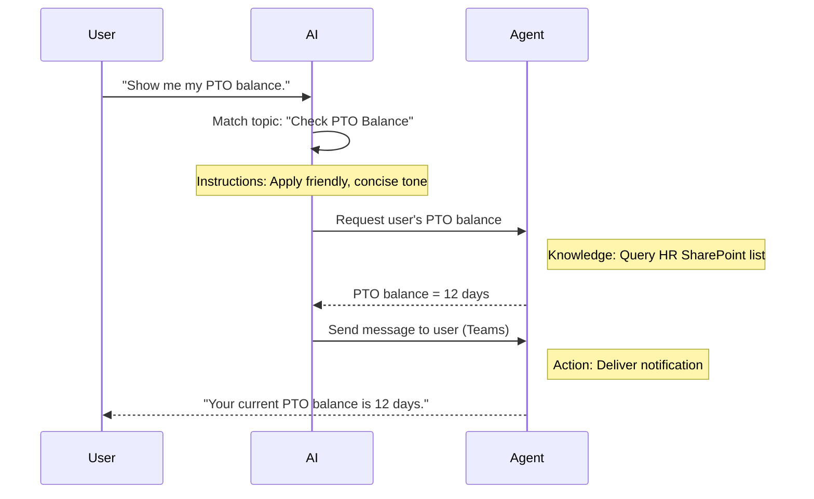

<div class="info-box note translated-post" markdown="1">
**원문 번역 게시물** — 이 글은 [Copilot Studio Agent Academy](https://microsoft.github.io/agent-academy/)의 원문 [Mission 02: Copilot Studio Fundamentals](https://microsoft.github.io/agent-academy/recruit/02-copilot-studio-fundamentals/)을 한글로 옮긴 것입니다. 원문 표현이 우선합니다.
</div>

## 영상으로 보기

- YouTube walkthrough: https://www.youtube.com/watch?v=x4OCwDRGeLE

<figure class="screenshot">
  
  <figcaption>Copilot Studio Fundamentals 동영상 썸네일</figcaption>
</figure>

## 미션 브리핑

환영합니다, Recruit. 이 미션에서는 Copilot Studio가 어떻게 동작하는지, 그리고 실제 비즈니스 가치를 내는 지능형 에이전트를 어떻게 설계하는지 이해하기 위한 핵심 정보를 익힙니다.

첫 에이전트를 만들기 전에, 모든 커스텀 AI 에이전트를 구성하는 네 가지 핵심 요소인 Knowledge, Tools, Topics, Instructions를 이해해야 합니다. 또 이 요소들이 Copilot Studio 오케스트레이터 안에서 어떻게 함께 동작하는지도 배우게 됩니다.

<div class="info-box note" markdown="1">
**중요 — 이 미션은 클래식 Copilot Studio 환경을 사용합니다**
Microsoft Copilot Studio는 새 작성 환경을 순차적으로 배포하고 있습니다. 이 미션의 개념은 그대로 적용되지만, 과정의 스크린샷과 탐색 경로는 **클래식 환경**을 기준으로 합니다. 이후 미션에서 화면이 다르게 보이면 오른쪽 위의 **New Experience**를 끄고 따라오세요.
</div>

## 목표

이 미션에서 다루는 내용은 다음과 같습니다.

1. Copilot Studio가 무엇이며 언제 사용해야 하는지
2. 조직이 지식과 자동화 시나리오를 위해 에이전트를 구축하는 이유
3. Knowledge, Tools, Topics, Instructions가 에이전트를 형성하는 방식
4. Copilot Studio 오케스트레이터가 이 구성 요소들을 함께 작동시키는 방식

## Copilot Studio의 에이전트란?

**에이전트(agent)** 는 특정 작업을 처리하도록 설계한 전문 AI 도우미입니다. 범용 챗봇과 달리, 에이전트는 다음과 같은 특징을 가집니다.

- **회사 고유의 데이터**(정책, 문서, 데이터베이스)를 알고 있음  
- **현실 업무를 수행**할 수 있음(메시지 전송, 일정 생성, 레코드 업데이트)  
- **대화 컨텍스트를 유지**해 앞선 질문을 이어받을 수 있음

Copilot Studio는 로우코드 도구이므로, 코딩 경험이 없어도 미리 준비된 구성 요소를 드래그 앤 드롭해 에이전트를 만들 수 있습니다. 에이전트를 완성하면 Teams, Slack, 커스텀 웹페이지 등에서 사용해 답변을 제공하거나 워크플로를 자동으로 실행할 수 있습니다.

## 언제, 왜 Copilot Studio를 사용해야 할까

Microsoft 365 Copilot은 Office 앱 전반에서 범용 AI 지원을 제공하지만, 다음과 같은 경우에는 커스텀 에이전트가 더 적합합니다.

### 여러 지식 원본을 조합해야 할 때

- M365 Copilot은 SharePoint, Outlook 등 Microsoft 365 내부 컨텍스트를 가져오는 데 강점이 있지만, 더 다양한 지식 원본을 함께 검색해야 하는 상황이라면 에이전트가 좋은 선택입니다.

### 여러 단계의 워크플로를 자동화하고 싶을 때

- 예: “누군가 비용을 제출하면 승인 요청을 보내고, 재무 추적기를 업데이트한 뒤, 관리자에게 알림을 보내기.” 커스텀 에이전트는 이런 다단계 흐름을 하나의 명령 또는 이벤트로 처리할 수 있습니다.

### 도구 안에서 자연스럽게 이어지는 맥락형 경험이 필요할 때

- 예를 들어 Teams 안의 신규 입사자 온보딩 에이전트는 HR 담당자에게 정책을 안내하고, 필요한 양식을 보내고, 오리엔테이션 일정을 잡는 과정을 기존 협업 도구 안에서 바로 이어서 제공할 수 있습니다.

## 에이전트의 네 가지 핵심 구성 요소

모든 Copilot Studio 에이전트는 다음 네 가지 핵심 요소로 구성됩니다.

1. **Knowledge**  
2. **Tools (Actions)**  
3. **Topics**  
4. **Instructions**

아래에서는 각 요소를 정의하고, 이들이 어떻게 함께 작동해 효과적인 에이전트를 만드는지 설명합니다.

### 1. Knowledge

**Knowledge** 는 에이전트가 질문에 정확하게 답하기 위해 사용하는 데이터와 컨텍스트입니다. 크게 두 부분으로 나뉩니다.

#### Custom Instructions & Context

- 에이전트의 목적과 말투를 짧게 설명합니다. 예를 들면 다음과 같습니다.

```text
You are an IT support agent. You help employees troubleshoot common software issues, provide troubleshooting steps, and escalate urgent tickets.
```

- 대화 중 에이전트는 이전 턴을 기억하므로, 이미 논의한 내용을 이어서 참조할 수 있습니다. 예를 들어 사용자가 먼저 “프린터가 오프라인이에요”라고 말하고 나중에 “잉크 잔량은 확인했나요?”라고 물으면, 에이전트는 프린터 맥락을 기억한 채 답할 수 있습니다.

#### Knowledge Sources (Grounding Data)

- 에이전트를 SharePoint 라이브러리, 문서 사이트, 위키, 기타 데이터베이스 등 여러 데이터 원본에 연결할 수 있습니다.  
- 사용자가 질문하면, 에이전트는 해당 원본에서 관련 내용을 가져와 답변을 조직의 실제 정책, 제품 설명서, 독점 정보에 **근거(grounded)** 하도록 만듭니다.  
- 심지어 해당 원본 안의 정보만으로 답하도록 강제해, 추측이나 환각성 답변을 줄일 수도 있습니다.

<div class="info-box note" markdown="1">
**예시**  
“Policy Assistant” 에이전트가 HR SharePoint 사이트에 연결되어 있다고 가정해 보세요. 사용자가 “우리 PTO 적립률이 얼마예요?”라고 물으면, 일반적인 AI 답변에 의존하는 대신 HR 정책 문서의 정확한 문구를 가져와 답할 수 있습니다.
</div>

### 2. Tools (Actions)

**Tools (Actions)** 는 에이전트가 단순 대화 이상으로 무엇을 할 수 있는지를 정의합니다. 각 Action은 다음과 같은 작업을 프로그래밍 방식으로 실행하는 단위입니다.

- 이메일 또는 Teams 메시지 보내기  
- 일정 이벤트 만들기 또는 업데이트  
- 데이터베이스 레코드 추가/수정(예: SharePoint 목록, Dataverse 테이블)  
- Power Automate 흐름 또는 REST API 호출

#### Actions는 어떻게 동작하는가

- **입력과 출력 정의**  
  - 예를 들어 Send Email 액션은 다음 값을 입력으로 받을 수 있습니다.  
    - `RecipientEmailAddress`  
    - `SubjectLine`  
    - `EmailBody`

- **액션을 워크플로로 조합**  
  - 사용자 요청을 처리하려면 여러 단계가 필요한 경우가 많습니다.  
  - 예를 들어 다음 순서로 액션을 이어 붙일 수 있습니다.  
    1. SharePoint 목록에서 데이터를 가져온다.  
    2. LLM으로 요약을 생성한다.  
    3. 그 요약을 Teams 메시지로 보낸다.

- **외부 시스템 연결**  
  - CRM 업데이트나 내부 API 호출이 필요하다면 이를 처리하는 커스텀 액션을 만들 수 있습니다.  
  - Copilot Studio는 Power Platform 또는 HTTP 기반 엔드포인트와 통합할 수 있습니다.

<div class="info-box note" markdown="1">
**예시**

“Expense Helper” 에이전트는 다음처럼 동작할 수 있습니다.

1. “Submit Expense” 요청을 감지합니다.  
2. 양식에서 사용자의 비용 정보를 수집합니다.  
3. “Add to SharePoint List” 액션으로 데이터를 저장합니다.  
4. “Send Email” 액션을 트리거해 승인자에게 알립니다.
</div>

### 3. Topics

**Topics** 는 에이전트의 대화 트리거 또는 진입점을 정의합니다. 각 토픽은 하나의 기능 또는 질문 범주에 대응합니다.

#### Conversational Triggers

- 예를 들어 “Submit IT Ticket”, “Check Vacation Balance”, “Create Sales Report” 같은 토픽이 있을 수 있습니다.  
- Copilot Studio는 내부적으로 **generative orchestration**을 사용합니다. 즉, 정확히 일치하는 키워드에만 의존하지 않고, 사용자가 입력한 의도를 해석한 뒤 여러분이 작성한 짧은 설명을 바탕으로 적절한 토픽을 선택합니다.

#### Topic Descriptions

- 각 토픽에는 해당 토픽이 다루는 범위를 짧고 명확하게 설명하는 문장을 작성합니다.

<div class="info-box note" markdown="1">
**토픽 설명 예시**  
이 토픽은 문제 내용, 우선순위, 연락처 정보를 수집해 사용자가 IT 지원 티켓을 제출하도록 돕습니다.
</div>

- AI는 이 설명을 바탕으로, 사용자의 표현이 정확히 일치하지 않더라도 언제 이 토픽을 활성화해야 하는지 판단합니다.

#### Topics와 Actions의 연결

- 각 토픽은 하나 이상의 액션 또는 데이터 조회 단계와 연결됩니다.  
- AI가 토픽을 선택하면, 여러분이 정의한 순서에 따라 대화를 이끌고(후속 질문, 액션 호출, 결과 반환) 작업을 진행합니다.

<div class="info-box note" markdown="1">
**예시**  
사용자가 “새 노트북 설정을 도와주세요”라고 말하면, AI는 이 의도를 “Submit IT Ticket” 토픽과 연결할 수 있습니다. 그러면 에이전트는 노트북 모델과 사용자 정보를 묻고, 자동으로 헬프데스크 시스템에 티켓을 등록합니다.
</div>

### 4. Instructions

**Instructions**(때로는 “Prompts” 또는 “System Messages”)는 LLM의 말투, 스타일, 경계 조건을 안내합니다. 즉, 어떤 상황에서든 에이전트가 어떻게 답해야 하는지 방향을 잡아 줍니다.

#### Role & Persona

- 에이전트가 누구인지 알려 줍니다(예: “당신은 Contoso Retail의 고객 서비스 에이전트입니다.”).  
- 이를 통해 친근한 톤, 간결한 톤, 격식 있는 톤 등 상황에 맞는 응답 스타일을 정할 수 있습니다.

#### Response Guidelines

- 에이전트가 반드시 따라야 할 규칙을 지정합니다. 예를 들면 다음과 같습니다.  
  - “정책 정보는 항상 글머리표로 요약할 것.”  
  - “답을 모르면 ‘죄송하지만 해당 정보를 가지고 있지 않습니다.’라고 말할 것.”  
  - “맥락 밖의 기밀 데이터는 절대 포함하지 말 것.”

#### Memory & Context Rules

- 에이전트가 몇 턴까지 대화를 기억할지 지시할 수 있습니다.  
- 예: “이 사용자의 요청 세부 정보는 후속 질문 3회까지 기억할 것.”

<div class="info-box note" markdown="1">
**예시**  
“Benefits Advisor” 에이전트에는 다음과 같은 지침을 넣을 수 있습니다.  
“질문에 답할 때는 항상 최신 HR 핸드북을 참조하세요. 등록 마감일을 묻는다면 정책에 있는 정확한 날짜를 제공하세요. 답변은 150단어 이하로 유지하세요.”
</div>

## 네 가지 핵심 구성 요소는 어떻게 함께 작동하는가

**Knowledge**, **Tools**, **Topics**, **Instructions**를 조합하면 Copilot Studio의 AI 오케스트레이터는 다음과 같이 동작하는 에이전트를 만듭니다.

1. **관련 Topic을 감지**합니다(토픽 설명을 바탕으로 판단).  
2. **Instructions를 적용**해 말투를 정하고, 후속 질문 여부를 판단하며, 규칙을 강제합니다.  
3. **Knowledge Sources를 활용**해 답변을 조직 데이터에 근거하도록 만듭니다.  
4. **Tools (Actions)를 호출**해 메시지 전송, 레코드 업데이트, API 호출 같은 작업을 수행합니다.

내부적으로 오케스트레이터는 **generative planning** 접근 방식을 사용해 사용자 요청을 처리하기 위한 단계와 순서를 결정합니다. 예를 들어 이메일 전송이 실패하면, 여러분이 정의한 예외 처리 지침에 따라 추가 질문을 하거나 오류를 보고합니다. 또한 LLM은 대화 컨텍스트에 적응하므로 여러 턴에 걸쳐 메모리를 유지하고, 새로 들어온 정보를 반영해 응답을 계속 조정할 수 있습니다.

**시각적 흐름 예시**



## 미션 완료

성공적으로 완료한 내용은 다음과 같습니다.

- **Knowledge**: 에이전트가 사실 정보를 찾는 위치를 식별했습니다.
- **Tools**: 에이전트가 작업을 수행하고 다른 시스템에 연결하는 방식을 설명했습니다.
- **Topics**: 에이전트가 정의된 대화 경로를 처리하는 방식을 설명했습니다.
- **Instructions**: 규칙, 톤, 경계가 응답을 안내하는 방식을 설명했습니다.

다음으로 [Mission 03: Deploy a Declarative Agent for Microsoft 365 Copilot]({{ '/chapters/academy-recruit-03-create-a-declarative-agent-for-m365copilot/' | relative_url }})을 계속 진행하세요.

## 전술 리소스

- [Microsoft Copilot Studio 개요](https://learn.microsoft.com/microsoft-copilot-studio/fundamentals-what-is-copilot-studio)
- [Copilot Studio에서 에이전트 만들기](https://learn.microsoft.com/microsoft-copilot-studio/authoring-first-bot)
