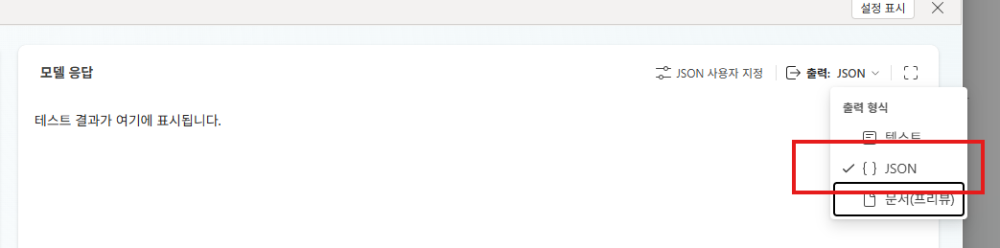

## Step 6: Excel 데이터 필터링 (심화)

# 6. Excel 데이터 필터링 + AI Prompt 연동 (심화)

> **이전 단계:** [5. AI Prompt 도구 추가](./5.%20AI%20Prompt%20도구%20추가.md) | **다음 단계:** [7. Teams 채널 배포](./7.%20Teams%20배포.md)

> ⚠️ **심화 실습입니다.** 기본 실습(1~5단계)을 모두 완료한 후 진행하세요.

---

## 이번 실습의 목표

SharePoint에 저장된 Excel 파일에서 **사용자 상황·수준에 맞는 데이터 행(Row)을 필터링**하고,  
해당 데이터를 **AI Prompt 도구에 전달**하여 맞춤형 답변을 생성하는 패턴을 구현합니다.

```
사용자 질문
    ↓
에이전트가 사용자 수준·상황 파악
    ↓
Excel 커넥터(테이블에 있는 행 나열)을 통해 필터링 기반 데이터 조회
    ↓
필터링된 데이터 → AI Prompt 도구 전달
    ↓
맞춤형 HTML 응답 생성
```

<br>

---

## 1. Excel 데이터 준비

### 1-1. Excel 파일 구조 설계

실습용 Excel 파일은 현재 SharePoint에 업로드되어있습니다.
엑셀은 반드시 테이블(표)로 변경해야합니다. (Ctrl + T)

예제

| 열(Column) | 설명 | 예시 값 |
|-----------|------|---------|
| `ID` | 고유 식별자 | 1, 2, 3 ... |
| `Category` | 데이터 카테고리 | 신입사원, 중급자, 전문가 |
| `Level` | 난이도/수준 | 기초, 중급, 고급 |
| `Title` | 항목 제목 | "Excel 기초 사용법" |
| `Content` | 상세 내용 | 설명 텍스트 |
| `Tags` | 검색 태그 | "Excel, 업무도구, 기초" |

> 실제 실습에서는 강사가 제공한 Excel 파일을 사용합니다.

<br>

### 1-2. SharePoint에 Excel 업로드

1. SharePoint 사이트 → 문서 라이브러리 이동
2. **업로드** 버튼으로 Excel 파일 업로드
3. 파일 경로 메모 (지식 소스 등록 시 필요)

<br>

---

## 2. Excel 커넥터를 통한 테이블 조회

에이전트 개요 → **도구** → **+ 도구 추가** → **Excel Online(business)** 를 선택합니다.
다음으로 **테이블이 있는 행 나열** 을 선택합니다.
> 테이블의 사이즈가 크며, 필터 기반으로 진행할 경우, **행 가져오기** 또는 스크립트를 통해 데이터를 가져오는 방법도 고려할 수 있습니다.

도구를 추가하고 세수 정보에 커넥터의 이름과 설명을 입력합니다.

| 설정 | 값 |
|-----------|------|
| `이름` | 서울 지역별 전기료 조회 | 
| `설명` | 서울시 지역별 전력사용량에 대한 분석이 필요하여 시계열 데이터 원본을 조회할 때 사용합니다.
 | 


이후  **입력** 창에 업로드한 Excel 파일이 있는 SharePoint 경로와 테이블을 입력하고 저장합니다
| 설정 | 다음을 사용하여 채우기 | 값 |
|-----------|------|---------|
| `Location` | 사용자 지정 값 | 쉐어포인트 사이트 |
| `Document Library` | 사용자 지정 값 | 쉐어포인트 파일 라이브러리 |
| `File` | 사용자 지정 값 | 파일 제목 |
| `Table` | 사용자 지정 값 | "테이블 이름" |


기본 정보 입력을 마쳤다면, 다음은 아래와 같이 [+ 입력 추가] 를 클릭하여 Filter Query를 추가합니다.


필터쿼리는, 엑셀의 데이터가 너무 많을 경우 토큰한도로 인해 처리가 불가하기 때문에 필요한 데이터만 조회하는 목적입니다.

쿼리는 AI가 자동으로 작성하지만, 작성을 위한 컬럼과 키는 설명이 필요하기 때문에 추가 세부사항에 아래와 같이 입력합니다.

```
An ODATA filter query to restrict the entries returned.
조회 대상 컬럼:  [년월 | 시군구] 둘중 하나를 선택합니다.
조회 대상 Key Value: Key Column에 따라 입력값이 변경됩니다.
년월은 YYYYMM 형식입니다.
시군구는 아래 중 하나를 선택합니다. [전체, 강남구, 강동구, 강북구, 강서구, 관악구, 광진구, 구로구, 금천구, 노원구, 도봉구, 동대문구, 동작구, 마포구, 서대문구, 서초구, 성동구, 성북구, 송파구, 양천구, 영등포구, 용산구, 은평구, 종로구, 중구, 중랑구] 
```


이후 실제로 동작하는지 프롬프트를 조회하면 정상적으로 쿼리를 작성하여 데이터를 조회해 오는것을 알 수 있습니다.
```
동대문구와 서울의 전력 사용량을 비교해줘
```


<br>

---

## 3. AI Prompt 도구 활용

Excel 데이터를 받아 사용자 맞춤형 응답을 생성하는 별도 AI Prompt 도구를 추가합니다.

### 3-1. 새 AI Prompt 도구 추가

도구 → **+ 도구 추가** → **프롬프트** 를 선택하고 아래와 같이 구성합니다.

**도구 이름:**
```
시계열 데이터 분석 프롬프트
```
**모델:**
```
자유롭게 선택합니다
```

**출력 형식**
```
모델응답창 우측에 출력을 기본 텍스트에서 JSON으로 변경합니다.
```



**중요! 변수 입력 방법** <br>
아래 프롬프트에는 에이전트가 입력해주는 데이터가 필요합니다.(사용자 요청사항, 시계열 데이터) 아래 프롬프트를 창에 입력 한 후,
[요청사항], [RAW_Data] 부분을 지우고 그림과 같이 / 를 눌러 텍스트로 변수를 지정합니다.


> 샘플값은 프롬프트 스크롤을 내려 아래에 정리되어 있습니다.

**프롬프트:**

```
당신은 시계열 데이터 분석 전문가입니다.
Excel 테이블에서 가져온 원본 데이터를 기반으로, 사용자의 요청에 맞는 데이터 인사이트를 추출합니다.

사용자가 바로 읽을수 있는 텍스트 형식과
메일에 바로 발송가능한 형식의 HTML 형식 2가지를 만들어
JSON 포멧으로 답변합니다.


## 입력
- 사용자 요청: [요청사항]
- 시계열 데이터 원본: [RAW_Data]

## 분석 규칙
1. 사용자 요청을 먼저 파악하고, 요청과 관련된 데이터 행(Row)만 선별합니다.
2. 선별된 데이터에서 아래 관점의 인사이트를 도출합니다:
   - 합계, 평균, 최대/최소값 및 해당 시점
   - 추세(증가/감소/안정) 판단
   - 이상치(평균 대비 ±30% 이상 벗어난 값) 식별
   - 주요 패턴(요일별, 월별, 계절별 등)
3. 데이터에 존재하지 않는 값은 절대 추측하거나 생성하지 않습니다.
4. 숫자는 천 단위 쉼표를 포함하고, 단위를 명확히 표기합니다.

## 출력 형식
아래 구조를 따라 응답합니다.

### 📊 분석 개요
- 분석 대상: [데이터 범위 또는 주제]
- 분석 기간: [시작일 ~ 종료일]
- 데이터 건수: [선별된 행 수]

### 📋 핵심 요약
| 지표 | 값 |
|------|-----|
| 합계 | [값 + 단위] |
| 평균 | [값 + 단위] |
| 최대 | [값 + 단위] ([시점]) |
| 최소 | [값 + 단위] ([시점]) |

### 💡 인사이트
각 인사이트는 반드시 아래 형식으로 작성합니다:

**[인사이트 1 제목]**
- 내용: [분석 결과 설명]
- 근거 데이터: [해당 인사이트를 도출한 구체적 데이터 값과 시점]

**[인사이트 2 제목]**
- 내용: [분석 결과 설명]
- 근거 데이터: [해당 인사이트를 도출한 구체적 데이터 값과 시점]

(인사이트 수는 데이터가 뒷받침하는 만큼만 작성합니다)

### 📈 시각화 (해당 시)
코드 인터프리터로 생성한 차트가 있으면 여기에 포함합니다.

### ⚠️ 이상치 / 특이사항
- [이상치 값], [시점] — [평균 대비 편차 %]

### 🔍 근거 데이터 상세
분석에 사용된 핵심 데이터를 표로 정리합니다:

| [시간 열] | [값 열] | 비고 |
|-----------|---------|------|
| [시점] | [값] | [평균 이상/이하/이상치 등] |

## 주의사항
- 사용자가 특정 지역, 기간, 조건을 지정하면 해당 범위만 분석합니다.
- 데이터가 부족하여 신뢰성 있는 분석이 어려운 경우, 그 한계를 명시합니다.
- 근거 데이터 상세 표는 행이 20개를 초과하면 상위/하위 주요 항목만 표시하고 나머지는 건수와 평균으로 요약합니다.

```

<br>

샘플데이터-요청사항

```
서울 전체와 동대문구의 전기 사용량에 대해 비교 분석해줘
```

샘플데이터-RAW_Data
```
[
  {
    "@odata.etag": "",
    "ItemInternalId": "a9a7125c-6b1a-42ac-9b45-ad1a3efa6861",
    "가구당 평균 전기요금(원)": "30,224 ",
    "가구당 평균 전력 사용량(kWh)": "232 ",
    "년월": "202301",
    "대상가구수(호)": "194,302 ",
    "시군구": "동대문구",
    "시도": "서울특별시"
  },
  {
    "@odata.etag": "",
    "ItemInternalId": "70f81c9a-98fb-487b-b427-f62050c27e9a",
    "가구당 평균 전기요금(원)": "30,163 ",
    "가구당 평균 전력 사용량(kWh)": "222 ",
    "년월": "202302",
    "대상가구수(호)": "195,983 ",
    "시군구": "동대문구",
    "시도": "서울특별시"
  },
  {
    "@odata.etag": "",
    "ItemInternalId": "17eee3cc-2b36-4776-be0d-0c05935a29f3",
    "가구당 평균 전기요금(원)": "23,822 ",
    "가구당 평균 전력 사용량(kWh)": "190 ",
    "년월": "202303",
    "대상가구수(호)": "196,079 ",
    "시군구": "동대문구",
    "시도": "서울특별시"
  },
  {
    "@odata.etag": "",
    "ItemInternalId": "84d58cb9-8957-45cf-a80a-1d49087b87ed",
    "가구당 평균 전기요금(원)": "24,622 ",
    "가구당 평균 전력 사용량(kWh)": "195 ",
    "년월": "202304",
    "대상가구수(호)": "196,216 ",
    "시군구": "동대문구",
    "시도": "서울특별시"
  },
  {
    "@odata.etag": "",
    "ItemInternalId": "3dd404bb-982c-47e7-9a95-0b3cd60f7fcd",
    "가구당 평균 전기요금(원)": "23,181 ",
    "가구당 평균 전력 사용량(kWh)": "186 ",
    "년월": "202305",
    "대상가구수(호)": "196,276 ",
    "시군구": "동대문구",
    "시도": "서울특별시"
  },
  {
    "@odata.etag": "",
    "ItemInternalId": "708bea58-396a-4cd9-bd3a-e66f2898f4f2",
    "가구당 평균 전기요금(원)": "26,628 ",
    "가구당 평균 전력 사용량(kWh)": "200 ",
    "년월": "202306",
    "대상가구수(호)": "196,327 ",
    "시군구": "동대문구",
    "시도": "서울특별시"
  },
  {
    "@odata.etag": "",
    "ItemInternalId": "fc18e187-a144-4c49-b28c-f93627fd0ccd",
    "가구당 평균 전기요금(원)": "34,178 ",
    "가구당 평균 전력 사용량(kWh)": "245 ",
    "년월": "202307",
    "대상가구수(호)": "196,389 ",
    "시군구": "동대문구",
    "시도": "서울특별시"
  },
  {
    "@odata.etag": "",
    "ItemInternalId": "c689efb0-ed7a-40bf-bd9c-611818d11ede",
    "가구당 평균 전기요금(원)": "46,034 ",
    "가구당 평균 전력 사용량(kWh)": "312 ",
    "년월": "202308",
    "대상가구수(호)": "196,419 ",
    "시군구": "동대문구",
    "시도": "서울특별시"
  },
  {
    "@odata.etag": "",
    "ItemInternalId": "be881ac8-9ec2-4901-9a00-7632705accb9",
    "가구당 평균 전기요금(원)": "41,215 ",
    "가구당 평균 전력 사용량(kWh)": "282 ",
    "년월": "202309",
    "대상가구수(호)": "196,956 ",
    "시군구": "동대문구",
    "시도": "서울특별시"
  },
  {
    "@odata.etag": "",
    "ItemInternalId": "d86b40d9-804c-4092-a932-a4be47152e96",
    "가구당 평균 전기요금(원)": "28,995 ",
    "가구당 평균 전력 사용량(kWh)": "210 ",
    "년월": "202310",
    "대상가구수(호)": "196,957 ",
    "시군구": "동대문구",
    "시도": "서울특별시"
  },
  {
    "@odata.etag": "",
    "ItemInternalId": "36dfb5ad-71a9-47ea-a06b-ebdfa7ec37e6",
    "가구당 평균 전기요금(원)": "26,603 ",
    "가구당 평균 전력 사용량(kWh)": "198 ",
    "년월": "202311",
    "대상가구수(호)": "197,132 ",
    "시군구": "동대문구",
    "시도": "서울특별시"
  },
  {
    "@odata.etag": "",
    "ItemInternalId": "43a9b3fc-e849-44a5-9dee-c78365c00a83",
    "가구당 평균 전기요금(원)": "29,087 ",
    "가구당 평균 전력 사용량(kWh)": "211 ",
    "년월": "202312",
    "대상가구수(호)": "197,700 ",
    "시군구": "동대문구",
    "시도": "서울특별시"
  },
  {
    "@odata.etag": "",
    "ItemInternalId": "f9e2261d-7541-4733-a87f-db920c7a2fb1",
    "가구당 평균 전기요금(원)": "33,259 ",
    "가구당 평균 전력 사용량(kWh)": "229 ",
    "년월": "202401",
    "대상가구수(호)": "197,901 ",
    "시군구": "동대문구",
    "시도": "서울특별시"
  },
  {
    "@odata.etag": "",
    "ItemInternalId": "6d642c15-d3ff-4455-827a-145b9f4e8e18",
    "가구당 평균 전기요금(원)": "32,109 ",
    "가구당 평균 전력 사용량(kWh)": "223 ",
    "년월": "202402",
    "대상가구수(호)": "198,194 ",
    "시군구": "동대문구",
    "시도": "서울특별시"
  },
  {
    "@odata.etag": "",
    "ItemInternalId": "7f3dd0d1-112a-4e4f-9272-4fd30ff0286d",
    "가구당 평균 전기요금(원)": "27,388 ",
    "가구당 평균 전력 사용량(kWh)": "201 ",
    "년월": "202403",
    "대상가구수(호)": "198,314 ",
    "시군구": "동대문구",
    "시도": "서울특별시"
  },
  {
    "@odata.etag": "",
    "ItemInternalId": "dd235af7-88eb-4cc6-aa00-712aac8a6ae3",
    "가구당 평균 전기요금(원)": "27,263 ",
    "가구당 평균 전력 사용량(kWh)": "200 ",
    "년월": "202404",
    "대상가구수(호)": "199,178 ",
    "시군구": "동대문구",
    "시도": "서울특별시"
  },
  {
    "@odata.etag": "",
    "ItemInternalId": "0f197c03-e6d6-4b62-be5b-8087f08f1cb3",
    "가구당 평균 전기요금(원)": "24,417 ",
    "가구당 평균 전력 사용량(kWh)": "184 ",
    "년월": "202405",
    "대상가구수(호)": "201,848 ",
    "시군구": "동대문구",
    "시도": "서울특별시"
  },
  {
    "@odata.etag": "",
    "ItemInternalId": "493046b6-4a8e-41dc-a043-78974111c8cf",
    "가구당 평균 전기요금(원)": "27,357 ",
    "가구당 평균 전력 사용량(kWh)": "201 ",
    "년월": "202406",
    "대상가구수(호)": "201,939 ",
    "시군구": "동대문구",
    "시도": "서울특별시"
  },
  {
    "@odata.etag": "",
    "ItemInternalId": "bb1a1e1b-0394-4299-9543-292ef306bbe5",
    "가구당 평균 전기요금(원)": "34,833 ",
    "가구당 평균 전력 사용량(kWh)": "247 ",
    "년월": "202407",
    "대상가구수(호)": "202,080 ",
    "시군구": "동대문구",
    "시도": "서울특별시"
  },
  {
    "@odata.etag": "",
    "ItemInternalId": "6fbaf371-c2ea-4683-8a14-f0c54d842b91",
    "가구당 평균 전기요금(원)": "50,115 ",
    "가구당 평균 전력 사용량(kWh)": "328 ",
    "년월": "202408",
    "대상가구수(호)": "202,180 ",
    "시군구": "동대문구",
    "시도": "서울특별시"
  },
  {
    "@odata.etag": "",
    "ItemInternalId": "046988e3-246c-4770-9623-fa8c489b06ac",
    "가구당 평균 전기요금(원)": "52,793 ",
    "가구당 평균 전력 사용량(kWh)": "330 ",
    "년월": "202409",
    "대상가구수(호)": "202,506 ",
    "시군구": "동대문구",
    "시도": "서울특별시"
  },
  {
    "@odata.etag": "",
    "ItemInternalId": "e874ec4c-0f21-4f8b-826a-7d27de0fe2c9",
    "가구당 평균 전기요금(원)": "33,768 ",
    "가구당 평균 전력 사용량(kWh)": "231 ",
    "년월": "202410",
    "대상가구수(호)": "202,742 ",
    "시군구": "동대문구",
    "시도": "서울특별시"
  },
  {
    "@odata.etag": "",
    "ItemInternalId": "ef619fb3-6c22-4a08-9f9d-917602a5fb46",
    "가구당 평균 전기요금(원)": "25,785 ",
    "가구당 평균 전력 사용량(kWh)": "192 ",
    "년월": "202411",
    "대상가구수(호)": "203,408 ",
    "시군구": "동대문구",
    "시도": "서울특별시"
  },
  {
    "@odata.etag": "",
    "ItemInternalId": "992eb523-daf5-4ba5-8b68-a2fdd728d070",
    "가구당 평균 전기요금(원)": "27,517 ",
    "가구당 평균 전력 사용량(kWh)": "201 ",
    "년월": "202412",
    "대상가구수(호)": "205,337 ",
    "시군구": "동대문구",
    "시도": "서울특별시"
  },
  {
    "@odata.etag": "",
    "ItemInternalId": "d7b3994c-63d1-454c-9f55-280245b2a58a",
    "가구당 평균 전기요금(원)": "32,231 ",
    "가구당 평균 전력 사용량(kWh)": "222 ",
    "년월": "202501",
    "대상가구수(호)": "205,164 ",
    "시군구": "동대문구",
    "시도": "서울특별시"
  },
  {
    "@odata.etag": "",
    "ItemInternalId": "f820a952-572e-4802-9e71-e48d8118177e",
    "가구당 평균 전기요금(원)": "32,319 ",
    "가구당 평균 전력 사용량(kWh)": "222 ",
    "년월": "202502",
    "대상가구수(호)": "204,677 ",
    "시군구": "동대문구",
    "시도": "서울특별시"
  },
  {
    "@odata.etag": "",
    "ItemInternalId": "4ce58f24-1149-44be-98e6-2db1a61b0574",
    "가구당 평균 전기요금(원)": "26,712 ",
    "가구당 평균 전력 사용량(kWh)": "196 ",
    "년월": "202503",
    "대상가구수(호)": "204,617 ",
    "시군구": "동대문구",
    "시도": "서울특별시"
  },
  {
    "@odata.etag": "",
    "ItemInternalId": "4842fd4a-fbbb-4ddc-880a-f9e06d5dbce2",
    "가구당 평균 전기요금(원)": "27,237 ",
    "가구당 평균 전력 사용량(kWh)": "200 ",
    "년월": "202504",
    "대상가구수(호)": "204,190 ",
    "시군구": "동대문구",
    "시도": "서울특별시"
  },
  {
    "@odata.etag": "",
    "ItemInternalId": "bbfb90a6-86ed-49cf-816d-5c56af806a70",
    "가구당 평균 전기요금(원)": "24,931 ",
    "가구당 평균 전력 사용량(kWh)": "187 ",
    "년월": "202505",
    "대상가구수(호)": "204,016 ",
    "시군구": "동대문구",
    "시도": "서울특별시"
  },
  {
    "@odata.etag": "",
    "ItemInternalId": "66a8ffbf-2322-439d-af80-9148b21ed0df",
    "가구당 평균 전기요금(원)": "27,877 ",
    "가구당 평균 전력 사용량(kWh)": "205 ",
    "년월": "202506",
    "대상가구수(호)": "203,946 ",
    "시군구": "동대문구",
    "시도": "서울특별시"
  },
  {
    "@odata.etag": "",
    "ItemInternalId": "5a79e04a-9c2b-4918-9b78-a9bc54216806",
    "가구당 평균 전기요금(원)": "39,365 ",
    "가구당 평균 전력 사용량(kWh)": "268 ",
    "년월": "202507",
    "대상가구수(호)": "203,891 ",
    "시군구": "동대문구",
    "시도": "서울특별시"
  },
  {
    "@odata.etag": "",
    "ItemInternalId": "199cd259-a7b2-41c8-8439-e205e50d90e9",
    "가구당 평균 전기요금(원)": "53,497 ",
    "가구당 평균 전력 사용량(kWh)": "344 ",
    "년월": "202508",
    "대상가구수(호)": "203,974 ",
    "시군구": "동대문구",
    "시도": "서울특별시"
  },
  {
    "@odata.etag": "",
    "ItemInternalId": "af5aec09-9950-45ce-9cbb-8bbeb2147bcf",
    "가구당 평균 전기요금(원)": "49,015 ",
    "가구당 평균 전력 사용량(kWh)": "316 ",
    "년월": "202509",
    "대상가구수(호)": "204,025 ",
    "시군구": "동대문구",
    "시도": "서울특별시"
  },
  {
    "@odata.etag": "",
    "ItemInternalId": "ddcb252d-dba8-4859-8640-b8ae84c943d4",
    "가구당 평균 전기요금(원)": "29,609 ",
    "가구당 평균 전력 사용량(kWh)": "211 ",
    "년월": "202510",
    "대상가구수(호)": "209,568 ",
    "시군구": "동대문구",
    "시도": "서울특별시"
  },
  {
    "@odata.etag": "",
    "ItemInternalId": "f54527e4-9a46-4043-85e6-297ce19a35fd",
    "가구당 평균 전기요금(원)": "26,430 ",
    "가구당 평균 전력 사용량(kWh)": "195 ",
    "년월": "202511",
    "대상가구수(호)": "209,734 ",
    "시군구": "동대문구",
    "시도": "서울특별시"
  },
  {
    "@odata.etag": "",
    "ItemInternalId": "b25469c0-e33d-406c-95e9-b545706db0a6",
    "가구당 평균 전기요금(원)": "27,894 ",
    "가구당 평균 전력 사용량(kWh)": "202 ",
    "년월": "202512",
    "대상가구수(호)": "209,627 ",
    "시군구": "동대문구",
    "시도": "서울특별시"
  }
]

[
  {
    "@odata.etag": "",
    "ItemInternalId": "6939a4c2-678b-4a93-9107-c5f7448306ab",
    "가구당 평균 전기요금(원)": "33,227 ",
    "가구당 평균 전력 사용량(kWh)": "247 ",
    "년월": "202301",
    "대상가구수(호)": "4,807,229 ",
    "시군구": "전체",
    "시도": "서울특별시"
  },
  {
    "@odata.etag": "",
    "ItemInternalId": "d32622b9-7f28-4018-87ce-cc07f817ca64",
    "가구당 평균 전기요금(원)": "32,909 ",
    "가구당 평균 전력 사용량(kWh)": "238 ",
    "년월": "202302",
    "대상가구수(호)": "4,813,757 ",
    "시군구": "전체",
    "시도": "서울특별시"
  },
  {
    "@odata.etag": "",
    "ItemInternalId": "10c974c4-cb64-40cf-bdb9-5e3d865de5db",
    "가구당 평균 전기요금(원)": "26,256 ",
    "가구당 평균 전력 사용량(kWh)": "204 ",
    "년월": "202303",
    "대상가구수(호)": "4,818,859 ",
    "시군구": "전체",
    "시도": "서울특별시"
  },
  {
    "@odata.etag": "",
    "ItemInternalId": "d62630a0-8cf8-4551-a0cc-7751035f3491",
    "가구당 평균 전기요금(원)": "27,168 ",
    "가구당 평균 전력 사용량(kWh)": "210 ",
    "년월": "202304",
    "대상가구수(호)": "4,821,114 ",
    "시군구": "전체",
    "시도": "서울특별시"
  },
  {
    "@odata.etag": "",
    "ItemInternalId": "78f83354-e009-4e16-88ca-4a745cad6f99",
    "가구당 평균 전기요금(원)": "25,795 ",
    "가구당 평균 전력 사용량(kWh)": "201 ",
    "년월": "202305",
    "대상가구수(호)": "4,825,130 ",
    "시군구": "전체",
    "시도": "서울특별시"
  },
  {
    "@odata.etag": "",
    "ItemInternalId": "256af787-78fc-486c-b846-0aa53bd6021e",
    "가구당 평균 전기요금(원)": "29,845 ",
    "가구당 평균 전력 사용량(kWh)": "216 ",
    "년월": "202306",
    "대상가구수(호)": "4,828,850 ",
    "시군구": "전체",
    "시도": "서울특별시"
  },
  {
    "@odata.etag": "",
    "ItemInternalId": "73ed35ac-fd59-48b7-8237-a9eceb719ed7",
    "가구당 평균 전기요금(원)": "38,599 ",
    "가구당 평균 전력 사용량(kWh)": "266 ",
    "년월": "202307",
    "대상가구수(호)": "4,834,192 ",
    "시군구": "전체",
    "시도": "서울특별시"
  },
  {
    "@odata.etag": "",
    "ItemInternalId": "ca72f819-f4da-4fa2-8097-81c7cf9223a7",
    "가구당 평균 전기요금(원)": "52,895 ",
    "가구당 평균 전력 사용량(kWh)": "340 ",
    "년월": "202308",
    "대상가구수(호)": "4,838,055 ",
    "시군구": "전체",
    "시도": "서울특별시"
  },
  {
    "@odata.etag": "",
    "ItemInternalId": "e1b6e367-578b-4864-8b5b-58e49363985a",
    "가구당 평균 전기요금(원)": "43,930 ",
    "가구당 평균 전력 사용량(kWh)": "",
    "년월": "202309",
    "대상가구수(호)": "4,843,078 ",
    "시군구": "전체",
    "시도": "서울특별시"
  },
  {
    "@odata.etag": "",
    "ItemInternalId": "923f18bd-d11d-4975-82a0-a34cd2665360",
    "가구당 평균 전기요금(원)": "28,357 ",
    "가구당 평균 전력 사용량(kWh)": "216 ",
    "년월": "202310",
    "대상가구수(호)": "4,848,664 ",
    "시군구": "전체",
    "시도": "서울특별시"
  },
  {
    "@odata.etag": "",
    "ItemInternalId": "db877330-fef3-4fbf-b054-cc24895d98a5",
    "가구당 평균 전기요금(원)": "29,064 ",
    "가구당 평균 전력 사용량(kWh)": "211 ",
    "년월": "202311",
    "대상가구수(호)": "4,857,156 ",
    "시군구": "전체",
    "시도": "서울특별시"
  },
  {
    "@odata.etag": "",
    "ItemInternalId": "f36922ea-9878-440c-8553-452936872c54",
    "가구당 평균 전기요금(원)": "31,804 ",
    "가구당 평균 전력 사용량(kWh)": "224 ",
    "년월": "202312",
    "대상가구수(호)": "4,870,737 ",
    "시군구": "전체",
    "시도": "서울특별시"
  },
  {
    "@odata.etag": "",
    "ItemInternalId": "4537edd5-7670-49f2-a900-3f99072fa1d0",
    "가구당 평균 전기요금(원)": "35,834 ",
    "가구당 평균 전력 사용량(kWh)": "242 ",
    "년월": "202401",
    "대상가구수(호)": "4,874,414 ",
    "시군구": "전체",
    "시도": "서울특별시"
  },
  {
    "@odata.etag": "",
    "ItemInternalId": "392bb5a9-6aed-452b-ba63-34b881ae86b3",
    "가구당 평균 전기요금(원)": "34,401 ",
    "가구당 평균 전력 사용량(kWh)": "235 ",
    "년월": "202402",
    "대상가구수(호)": "4,877,485 ",
    "시군구": "전체",
    "시도": "서울특별시"
  },
  {
    "@odata.etag": "",
    "ItemInternalId": "c7bb47af-b643-4ce9-a6d9-84011eab5ff3",
    "가구당 평균 전기요금(원)": "29,629 ",
    "가구당 평균 전력 사용량(kWh)": "213 ",
    "년월": "202403",
    "대상가구수(호)": "4,880,106 ",
    "시군구": "전체",
    "시도": "서울특별시"
  },
  {
    "@odata.etag": "",
    "ItemInternalId": "c184a54d-d4c3-4126-88c6-4f2d0e9bf822",
    "가구당 평균 전기요금(원)": "29,231 ",
    "가구당 평균 전력 사용량(kWh)": "211 ",
    "년월": "202404",
    "대상가구수(호)": "4,882,040 ",
    "시군구": "전체",
    "시도": "서울특별시"
  },
  {
    "@odata.etag": "",
    "ItemInternalId": "7915016c-e157-4bad-aa1d-6a958d2b4e89",
    "가구당 평균 전기요금(원)": "26,766 ",
    "가구당 평균 전력 사용량(kWh)": "198 ",
    "년월": "202405",
    "대상가구수(호)": "4,885,748 ",
    "시군구": "전체",
    "시도": "서울특별시"
  },
  {
    "@odata.etag": "",
    "ItemInternalId": "657c09fe-4a5b-4848-bb4a-4acd3d48a868",
    "가구당 평균 전기요금(원)": "30,627 ",
    "가구당 평균 전력 사용량(kWh)": "218 ",
    "년월": "202406",
    "대상가구수(호)": "4,890,087 ",
    "시군구": "전체",
    "시도": "서울특별시"
  },
  {
    "@odata.etag": "",
    "ItemInternalId": "51398cd9-ba01-4cb4-b70f-3e4d0a0db209",
    "가구당 평균 전기요금(원)": "38,917 ",
    "가구당 평균 전력 사용량(kWh)": "267 ",
    "년월": "202407",
    "대상가구수(호)": "4,890,640 ",
    "시군구": "전체",
    "시도": "서울특별시"
  },
  {
    "@odata.etag": "",
    "ItemInternalId": "6ef64d6c-b105-4f3b-a38d-1be9b81b88ed",
    "가구당 평균 전기요금(원)": "59,337 ",
    "가구당 평균 전력 사용량(kWh)": "364 ",
    "년월": "202408",
    "대상가구수(호)": "4,893,594 ",
    "시군구": "전체",
    "시도": "서울특별시"
  },
  {
    "@odata.etag": "",
    "ItemInternalId": "60f23d24-5715-4b74-b56b-35169a0b5275",
    "가구당 평균 전기요금(원)": "57,155 ",
    "가구당 평균 전력 사용량(kWh)": "346 ",
    "년월": "202409",
    "대상가구수(호)": "4,897,255 ",
    "시군구": "전체",
    "시도": "서울특별시"
  },
  {
    "@odata.etag": "",
    "ItemInternalId": "0fa5f9c6-49b5-451f-80e1-e95e51b54013",
    "가구당 평균 전기요금(원)": "34,668 ",
    "가구당 평균 전력 사용량(kWh)": "236 ",
    "년월": "202410",
    "대상가구수(호)": "4,902,482 ",
    "시군구": "전체",
    "시도": "서울특별시"
  },
  {
    "@odata.etag": "",
    "ItemInternalId": "ee142ab4-944f-4ec7-8481-1b282c351b51",
    "가구당 평균 전기요금(원)": "28,440 ",
    "가구당 평균 전력 사용량(kWh)": "207 ",
    "년월": "202411",
    "대상가구수(호)": "4,911,167 ",
    "시군구": "전체",
    "시도": "서울특별시"
  },
  {
    "@odata.etag": "",
    "ItemInternalId": "0523f470-8839-4fda-a902-843a1a28f7ad",
    "가구당 평균 전기요금(원)": "31,022 ",
    "가구당 평균 전력 사용량(kWh)": "219 ",
    "년월": "202412",
    "대상가구수(호)": "4,916,320 ",
    "시군구": "전체",
    "시도": "서울특별시"
  },
  {
    "@odata.etag": "",
    "ItemInternalId": "9df71363-8148-44a6-b8b2-35885297729a",
    "가구당 평균 전기요금(원)": "35,727 ",
    "가구당 평균 전력 사용량(kWh)": "241 ",
    "년월": "202501",
    "대상가구수(호)": "4,917,321 ",
    "시군구": "전체",
    "시도": "서울특별시"
  },
  {
    "@odata.etag": "",
    "ItemInternalId": "3af629b7-e36f-4059-963b-6ff552375fc9",
    "가구당 평균 전기요금(원)": "35,495 ",
    "가구당 평균 전력 사용량(kWh)": "240 ",
    "년월": "202502",
    "대상가구수(호)": "4,922,253 ",
    "시군구": "전체",
    "시도": "서울특별시"
  },
  {
    "@odata.etag": "",
    "ItemInternalId": "6eeb9c27-eb09-4372-ac23-68d592aafbc2",
    "가구당 평균 전기요금(원)": "29,199 ",
    "가구당 평균 전력 사용량(kWh)": "210 ",
    "년월": "202503",
    "대상가구수(호)": "4,924,777 ",
    "시군구": "전체",
    "시도": "서울특별시"
  },
  {
    "@odata.etag": "",
    "ItemInternalId": "2fe4fea9-a293-4f1d-850d-75dbdc9b6a4e",
    "가구당 평균 전기요금(원)": "29,483 ",
    "가구당 평균 전력 사용량(kWh)": "212 ",
    "년월": "202504",
    "대상가구수(호)": "4,930,624 ",
    "시군구": "전체",
    "시도": "서울특별시"
  },
  {
    "@odata.etag": "",
    "ItemInternalId": "b09054a8-e6ca-42cd-80fe-aaa595776b86",
    "가구당 평균 전기요금(원)": "27,122 ",
    "가구당 평균 전력 사용량(kWh)": "200 ",
    "년월": "202505",
    "대상가구수(호)": "4,933,187 ",
    "시군구": "전체",
    "시도": "서울특별시"
  },
  {
    "@odata.etag": "",
    "ItemInternalId": "8948f142-3fb2-4f74-95d2-7bb281e72d68",
    "가구당 평균 전기요금(원)": "30,966 ",
    "가구당 평균 전력 사용량(kWh)": "220 ",
    "년월": "202506",
    "대상가구수(호)": "4,933,796 ",
    "시군구": "전체",
    "시도": "서울특별시"
  },
  {
    "@odata.etag": "",
    "ItemInternalId": "400c854e-7211-440f-8522-da9e55e01652",
    "가구당 평균 전기요금(원)": "44,646 ",
    "가구당 평균 전력 사용량(kWh)": "293 ",
    "년월": "202507",
    "대상가구수(호)": "4,935,855 ",
    "시군구": "전체",
    "시도": "서울특별시"
  },
  {
    "@odata.etag": "",
    "ItemInternalId": "81f19c56-1201-4123-b782-a68d7cfce172",
    "가구당 평균 전기요금(원)": "60,145 ",
    "가구당 평균 전력 사용량(kWh)": "370 ",
    "년월": "202508",
    "대상가구수(호)": "4,935,553 ",
    "시군구": "전체",
    "시도": "서울특별시"
  },
  {
    "@odata.etag": "",
    "ItemInternalId": "17201432-204d-40aa-ace7-81f6ae193260",
    "가구당 평균 전기요금(원)": "51,218 ",
    "가구당 평균 전력 사용량(kWh)": "323 ",
    "년월": "202509",
    "대상가구수(호)": "4,937,802 ",
    "시군구": "전체",
    "시도": "서울특별시"
  },
  {
    "@odata.etag": "",
    "ItemInternalId": "772455fe-150f-4e2a-9c1d-b6f93cc0c0e3",
    "가구당 평균 전기요금(원)": "31,304 ",
    "가구당 평균 전력 사용량(kWh)": "222 ",
    "년월": "202510",
    "대상가구수(호)": "4,948,833 ",
    "시군구": "전체",
    "시도": "서울특별시"
  },
  {
    "@odata.etag": "",
    "ItemInternalId": "4dbc4820-9a4c-42e6-9306-925379bbdc9e",
    "가구당 평균 전기요금(원)": "29,340 ",
    "가구당 평균 전력 사용량(kWh)": "212 ",
    "년월": "202511",
    "대상가구수(호)": "4,952,949 ",
    "시군구": "전체",
    "시도": "서울특별시"
  },
  {
    "@odata.etag": "",
    "ItemInternalId": "e48302c6-b05e-41f5-b7af-ca9c8d9caeb2",
    "가구당 평균 전기요금(원)": "31,411 ",
    "가구당 평균 전력 사용량(kWh)": "222 ",
    "년월": "202512",
    "대상가구수(호)": "4,952,068 ",
    "시군구": "전체",
    "시도": "서울특별시"
  }
]

```

입력을 마쳤으면 테스트 이후 저장하고 도구를 추가합니다.

추가된 도구에 아래와 같이 도구,변수 설명을 작성 합니다

**도구 설명:**
```
사용자의 수준과 상황 정보를 받아, Excel에서 필터링된 데이터를 맞춤형 학습/업무 가이드 형태로 재구성합니다.
사용자 수준에 맞는 콘텐츠를 제공해야 할 때 이 도구를 사용합니다.
```

**입력 변수:**

| 변수명 | 유형 | 설명 |
|--------|------|------|
| `요청 사항` | 텍스트 | 사용자가 분석하길 희망하는 요청 사항과 컨텍스트 입니다. |
| `RAW_Data` | 텍스트 | 시계열 데이터 원본입니다 |
---


## 4. 지침 업데이트

에이전트 지침에 아래 워크플로우를 추가합니다.


```
### 📊 지역별 전기 사용량 분석 요청 시
사용자가 지역별 전기 사용량 분석을 요청하면:
1. 사용자의 수준을 파악합니다. 
- 사용자가 명시한 경우: 그 수준을 사용합니다.   
- 명시하지 않은 경우: 대화 맥락으로 추론하거나 사용자에게 질문합니다.     
예: "어떤 수준의 내용을 원하시나요? (신입사원 / 중급자 / 전문가)"

2.  "테이블에 있는 행 나열"  를 호출하여, 서울 지역 전기 사용량 테이블 원본을 수집합니다.
3. 수집된 데이터 원본과 사용자 요청사항 및 맥락을 "시계열 데이터 분석 프롬프트"  도구에 전달합니다.*중요!: 반드시 원본데이터 그대로 입려해야 합니다.
4. 생성된 답변을 기반으로 사용자에게 전달합니다.
```


<br>

---

## 5. 동작 확인

**수준 명시 테스트:**
```
동대문구 전기 사용량 분석이 필요해. 서울과 비교해서 얼마나 차이가 나는지 알고 싶어. 
```
→ 에이전트가 엑셀 데이터를 조회 → "시계열 데이터 분석 프롬프트" 호출 → 답 반환


---

필요시, 메일 발송도구를 통해 생성된 HTML을 곧장 메일로 보내게도 구현할 수 있습니다.


> **학습 포인트:** 정형 데이터(Excel의 행/열 구조)와 생성형 AI(AI Prompt 도구)를 연결하는 패턴을 익혔습니다.  
> 에이전트가 데이터를 필터링하는 조건(사용자 수준, 상황)을 지침에 명시하면,  
> Power Automate 없이도 동적 데이터 기반 맞춤형 응답이 가능합니다.

<br>


---

> **다음 단계:** [7. Teams 채널 배포 및 테스트](./7.%20Teams%20배포.md)


---

---

← [이전: Step 5. AI Prompt 도구]({{ '/chapters/ws3-5-ai-prompt/' | relative_url }}) | [다음: Step 7. Teams 배포]({{ '/chapters/ws3-7-teams-deploy/' | relative_url }}) →