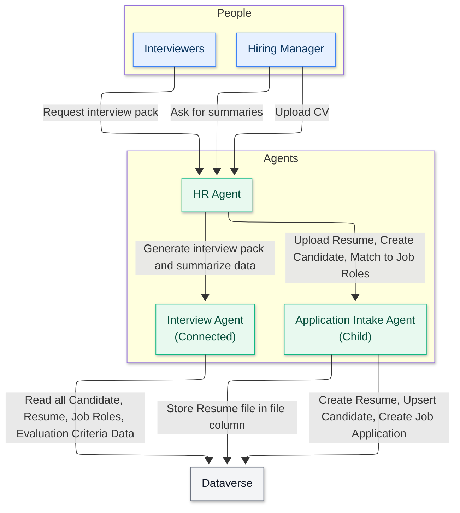

<div class="info-box note" markdown="1">
**Translated article** — This article is based on [🚨 Mission 03: Multi-Agent Systems](https://microsoft.github.io/agent-academy/operative/03-multi-agent/) from the [Copilot Studio Agent Academy](https://microsoft.github.io/agent-academy/). The original wording takes precedence.
</div>

🎥 **Watch the walkthrough**

<figure class="screenshot">
  <a href="https://www.youtube.com/watch?v=X-nyqdk6tcc" target="_blank" rel="noopener">
    
  </a>
  <figcaption>Multi-Agent Systems</figcaption>
</figure>

## 🎯 Mission brief

Welcome back, Agent. In Mission 01, you built your main Hiring Agent, giving you a solid foundation for managing recruitment workflows. But one agent can only do so much.

Your assignment is **Operation Symphony**. You will transform a single agent into a **multi-agent system**, orchestrating a team of specialized agents that work together to handle complex hiring challenges. Think of it as upgrading from a solo operator to commanding a specialized task force.

Like a symphony orchestra where each musician plays their part in perfect harmony, you will add two critical specialists to your existing Hiring Agent: an Application Intake Agent that processes resumes automatically, and an Interview Prep Agent that creates comprehensive interview materials. These agents will work together seamlessly under your main orchestrator.

<div class="info-box note" markdown="1">
**Note** — If your Copilot Studio screen looks different from the screenshots in this lesson, turn off **New Experience** in the upper-right corner to switch back to the **classic experience** used here.
</div>

## 🔎 Learning objectives

In this mission, you will learn:

1. When to use **child agents** and **connected agents**
1. How to design scalable **multi-agent architectures**
1. How to create **child agents** for focused tasks
1. How to establish **communication patterns** between agents
1. How to build the Application Intake Agent and Interview Prep Agent

## 🧠 What are connected agents?

In Copilot Studio, you are not limited to building a single, monolithic agent. You can create **multi-agent systems**: networks of specialized agents that work together to handle complex workflows.

Think of a real-world organization. Instead of one person doing everything, specialists excel at specific tasks and collaborate when needed.

### Why multi-agent systems matter

- **Scalability:** Each agent can be developed, tested, and maintained independently by different teams.
- **Specialization:** Agents can focus on what they do best. For example, one agent can handle data processing, another user interaction, and another decision-making.
- **Flexibility:** You can mix and match agents, reuse them across projects, and evolve your system incrementally.
- **Maintainability:** Changes to one agent do not necessarily affect other agents, making updates safer and easier.

### Real-world example: hiring process

In a hiring workflow, multiple agents can share responsibilities such as:

- **Resume intake** requires document parsing and data extraction skills.
- **Scoring** requires evaluating candidate resumes and matching them to job requirements.
- **Interview preparation** requires deep reasoning about candidate fit.
- **Candidate communication** requires empathetic communication skills.

Rather than building one massive agent that tries to handle all these different skills, you can create specialized agents for each area and orchestrate them together.

## 🔗 Child agents and connected agents: the key difference

Copilot Studio offers two ways to build multi-agent systems, each with distinct use cases.

### ↘️ Child agents

Child agents are **lightweight specialists** that run inside your main agent. Think of them as specialized teams within the same department.

#### Key technical details

- Child agents live within the parent agent and have a single configuration page.
- Tools and Knowledge are **stored at the parent** agent, but configured as "Available to" the child agent.
- Child agents **share the topics** of their parent agent. Topics can be referenced from child agent instructions.
- Child agents **do not need separate publishing**. Once created, they are automatically available within the parent agent. This makes testing easier because changes to parent and child agents can be performed in the **same shared workspace**.

#### Use child agents when

- A single team manages the entire solution
- You want to logically organize tools and knowledge into sub-agents
- You do not need separate authentication or deployment for each agent
- The agents do not need to be published separately or used independently
- You do not need to reuse agents across multiple solutions

**Example:** An IT help desk agent with child agents for:

- Password reset procedures
- Hardware troubleshooting
- Software installation guides

### 🔀 Connected agents

Connected agents are **full-fledged, independent agents** that your main agent can collaborate with. Think of them as separate departments working together on a project.

#### Key technical details

- Connected agents have **their own topics** and conversation flows. They operate independently with their own settings, logic, and deployment lifecycle.
- Connected agents **must be published** before they can be added to and used by other agents.
- During testing, changes to a connected agent must be published before the calling agent can use those changes.

#### Use connected agents when

- Multiple teams develop and maintain different agents independently
- Agents need their own settings, authentication, and deployment channels
- You want to publish and maintain agents separately with independent application lifecycle management (ALM) for each agent
- Agents should be reused across multiple solutions

**Example:** A customer service system that connects to:

- A separate billing agent maintained by the finance team
- A separate technical support agent maintained by the product team
- A separate returns agent maintained by the operations team

<div class="info-box note" markdown="1">
**Tip** — You can mix both approaches. For example, your main agent can connect to external agents from other teams while also having its own child agents for specialized internal tasks.
</div>

## 🎯 Multi-agent architecture patterns

When designing multi-agent systems, several patterns emerge based on how agents interact.

| Pattern | Description | Best fit |
| --- | --- | --- |
| **Hub and Spoke** | A main orchestrator agent coordinates multiple specialized agents. The orchestrator handles user interaction and delegates tasks to child agents or connected agents. | Complex workflows where one agent coordinates specialized tasks |
| **Pipeline** | Agents pass work sequentially from one agent to the next, with each stage adding value before handing off to the next stage. | Linear processes such as application processing (intake -> screening -> interview -> decision) |
| **Collaborative** | Agents work together simultaneously on different aspects of the same problem, sharing context and results. | Complex analysis requiring multiple perspectives or areas of expertise |

<div class="info-box note" markdown="1">
**Tip** — You can also use a hybrid of two or more of these patterns.
</div>

## 💬 Agent communication and context sharing

When agents work together, they need to share information effectively. Copilot Studio supports this in the following ways.

### Conversation history

By default, when a main agent calls a child agent or connected agent, it can pass along the **conversation history**. This gives the specialist agent full context about what the user has been discussing.

You can turn this off for security or performance reasons. For example, a specialist agent may only need to complete a specific task without the full conversation context. This can be a good way to defend against **data leakage**.

### Explicit instructions

The main agent can give **specific instructions** to a child agent or connected agent. For example: "Process this resume and provide a technical summary for the Senior Developer role."

### Return values

Agents can return structured information to the calling agent, allowing the main agent to use that information in later steps or share it with other agents.

### Dataverse integration

For more complex scenarios, agents can share information through **Dataverse** or other data stores, enabling persistent context sharing across multiple interactions.

## ↘️ Child agent: Application Intake Agent

Now let's start building the multi-agent hiring system. The first specialist is the **Application Intake Agent**, a child agent that processes incoming resumes and candidate information.



### 🤝 Application Intake Agent responsibilities

- **Parse resume content** from PDFs provided via interactive chat. (In a future mission, you will learn how to process resumes autonomously.)
- **Extract structured data** such as name, skills, experience, and education.
- **Match candidates to open roles** based on qualifications and cover letter.
- **Store candidate information** in Dataverse for later processing.
- **Deduplicate applications** to avoid creating the same candidate twice, and match to existing records using the email address extracted from the resume.

### ⭐ Why this should be a child agent

The Application Intake Agent is a good fit as a child agent because:

- It is specialized for document processing and data extraction.
- It does not need separate publishing.
- It is part of the overall hiring solution managed by the same team.
- It focuses on a specific trigger, receiving a new resume, and is invoked by the Hiring Agent.

## 🔀 Connected agent: Interview Prep Agent

The second specialist is the **Interview Prep Agent**. This connected agent helps create comprehensive interview materials and evaluate candidate responses.

### 🤝 Interview Prep Agent responsibilities

- **Create interview packs** that include company information, role requirements, and evaluation criteria
- **Generate interview questions** tailored to specific roles and candidate backgrounds
- **Answer general questions** about job roles and applications for stakeholder communication

### ⭐ Why this should be a connected agent

The Interview Prep Agent works better as a connected agent because:

- The talent acquisition team may want to use it independently across multiple hiring processes.
- It needs its own knowledge base of interview best practices and evaluation criteria.
- Different hiring managers may want to customize its behavior for their teams.
- It can be reused for internal positions, not just external hiring.

## 🧪 Lab 3.1 - Adding the Application Intake Agent

Now let's put theory into practice. Add your first child agent to the existing Hiring Agent.

### Prerequisites to complete this mission

To complete this mission, you need:

- **[Mission 01]({{ '/en/chapters/academy-operative-01-get-started/' | relative_url }})** completed, with your Hiring Agent ready

### 3.1.1 Solution setup

1. In Copilot Studio, select the ellipsis (...) below Tools in the left navigation.
1. Select **Solutions**.

    <figure class="screenshot">
      
      <figcaption>Select Solutions</figcaption>
    </figure>

1. Locate the Operative solution, select the **ellipsis (...)** next to it, and choose **Set preferred solution**. In the dialog that appears, select **Apply**. This ensures that all work you perform from now on is added to this solution.

    <figure class="screenshot">
      
      <figcaption>Set preferred solution</figcaption>
    </figure>

### 3.1.2 Configure the Hiring Agent's agent instructions

1. **Navigate** to Copilot Studio. Make sure your environment is selected in the **Environment Picker** in the upper-right corner.
1. Open the **Hiring Agent** you created in Mission 01.
1. In the agent's **Overview** tab, select **Edit** in the **Instructions** section.

    <figure class="screenshot">
      
      <figcaption>Edit Instructions</figcaption>
    </figure>

    Copy and paste the following instructions into the instructions input.

    ```text
    You are the central orchestrator for the hiring process. You coordinate activities, provide summaries, and delegate work to specialized agents.
    ```

1. Select **Save**.

    <figure class="screenshot">
      
      <figcaption>Hiring Agent instructions</figcaption>
    </figure>

1. Select the **Settings** button in the upper-right corner of the screen.

    <figure class="screenshot">
      
      <figcaption>Settings</figcaption>
    </figure>

1. Review the page and make sure the following settings are applied.

    | Setting | Value |
    | ------- | ----- |
    | Use generative AI orchestration for your agent's responses | **Yes** |
    | Deep Reasoning | **Off** |
    | Let other agents connect to and use this one | **On** |
    | Continue using retired models | **Off** |
    | Content Moderation | **Moderate** |
    | Collect user reactions to agent messages | **On** |
    | Use general knowledge | **Off** |
    | Use information from the Web | **Off** |
    | File uploads | **On** |
    | Code Interpreter | **Off** |

    <figure class="screenshot">
      
      <figcaption>Use Generative Orchestration</figcaption>
    </figure>

    <figure class="screenshot">
      
      <figcaption>Set moderate moderation</figcaption>
    </figure>

1. Click **Save**.

    <figure class="screenshot">
      
      <figcaption>Knowledge and Web settings</figcaption>
    </figure>

1. Click the **X** in the upper-right corner to close the settings menu.

    <figure class="screenshot">
      
      <figcaption>Close settings</figcaption>
    </figure>

### 3.1.3 Add the Application Intake child agent

1. **Navigate** to the **Agents** tab inside your Hiring Agent (this is where you add specialist agents) and select **Add**.

    <figure class="screenshot">
      
      <figcaption>Add button</figcaption>
    </figure>

1. Select **New child agent**.

    <figure class="screenshot">
      
      <figcaption>Add Child Agent</figcaption>
    </figure>

1. Name the agent ```Application Intake Agent```.
1. In the **When will this be used?** dropdown, select **The agent chooses**. These options are similar to the triggers you can configure for topics.
1. Set the **Description** to:

    ```text
    Processes incoming resumes and stores candidates in the system
    ```

    <figure class="screenshot">
      
      <figcaption>Application Intake Agent description</figcaption>
    </figure>

1. Expand **Advanced** and set Priority to `10000`. This ensures that later, the Interview Agent is used to answer general questions before this agent. You can also set a condition here, such as requiring at least one attachment.

    <figure class="screenshot">
      
      <figcaption>Priority</figcaption>
    </figure>

1. Make sure the **Web Search** toggle is set to **Disabled**. This is because you only want to use information provided by the parent agent.
1. Select **Save**.

    <figure class="screenshot">
      
      <figcaption>Web Search</figcaption>
    </figure>

### 3.1.4 Configure the Resume Upload agent flow

Agents cannot perform actions unless they are given tools or topics.

For the *Upload Resume* step, you use **Agent Flow tools** rather than Topics because this multi-step backend process requires deterministic execution and integration with external systems. While Topics are best for guiding conversational dialogs, Agent Flows provide the structured automation needed to reliably handle file processing, data validation, and database upserts (insert new or update existing) without depending on user interaction.

1. Locate the **Tools** section inside the Application Intake Agent page.
   **Important:** This is not the parent agent's Tools tab. You can find it by scrolling down below the child agent instructions.
1. Select **+ Add**.

    <figure class="screenshot">
      
      <figcaption>Add tool</figcaption>
    </figure>

1. Select **+ New tool**.

    <figure class="screenshot">
      
      <figcaption>Add new tool</figcaption>
    </figure>

1. Select **Agent flow**.
   The Agent Flow designer opens, where you will add the upload resume logic.

    <figure class="screenshot">
      
      <figcaption>Add Agent Flow</figcaption>
    </figure>

1. Select the **When an agent calls the flow** node, then select **+ Add an input**.

    <figure class="screenshot">
      
      <figcaption>Add input</figcaption>
    </figure>

1. Add inputs for each parameter in the table below. Select the appropriate input type shown in the table, and make sure to add both the name and the description. Including the description is important because it helps the agent know what to fill in for the input.

    | Type | Name | Description |
    | ---- | ---- | ----------- |
    | File | ```Resume``` | ```The Resume PDF file``` |
    | Text | ```Message``` | ```Extract a cover letter style message from the context. The message must be less than 2000 characters.``` |
    | Text | ```UserEmail``` | ```The email address that the Resume originated from. This will be the user uploading the resume in chat, or the from email address if received by email.``` |

    <figure class="screenshot">
      
      <figcaption>Configure input parameters</figcaption>
    </figure>

1. Select the **+ icon** below the **When an agent calls the flow** node, search for `Dataverse add`, then select the **Add a new row** action in the **Microsoft Dataverse** section.

    <figure class="screenshot">
      
      <figcaption>Add a new row node</figcaption>
    </figure>

    <div class="info-box note" markdown="1">
    **Note** — After adding the action, you may be prompted to create a new connection to Dataverse. Enter any name for the connection and click add to create it.
    </div>

1. Rename the node to **Create Resume** by selecting the **Add a new row node** and changing the tile name as shown.

    <figure class="screenshot">
      
      <figcaption>Rename node</figcaption>
    </figure>

1. Set **Table name** to **Resumes**, then select **Show all** to display all parameters.

    <figure class="screenshot">
      
      <figcaption>Show all</figcaption>
    </figure>

1. Set the following **properties**.

    | Property | How to Set | Details / Expression |
    | -------- | ---------- | -------------------- |
    | **Resume Title** | Dynamic data (thunderbolt icon) | **When an agent calls the flow** → **Resume name**    If you do not see the Resume name, make sure you configured the Resume parameter above as a data type. |
    | **Cover letter** | Expression (fx icon) | `if(greater(length(triggerBody()?['text']), 2000), substring(triggerBody()?['text'], 0, 2000), triggerBody()?['text'])` |
    | **Source Email Address** | Dynamic data (thunderbolt icon) | **When an agent calls the flow** → **UserEmail** |
    | **Upload Date** | Expression (fx icon) | `utcNow()` |

    <figure class="screenshot">
      
      <figcaption>Edit properties</figcaption>
    </figure>

1. Select the **+ icon** below the Create Resume node, search for `Dataverse upload`, then select the **Upload a file or an image** action.

    <figure class="screenshot">
      
      <figcaption>Upload select</figcaption>
    </figure>

   **Important:** Be careful not to select the **Upload a file or an image to the selected environment** action.

1. Name the node **Upload Resume File**.
1. Set the following **properties**.

    | Property | How to Set | Details |
    | -------- | ---------- | ------- |
    | **Content name** | Dynamic data (thunderbolt icon) | When an agent calls the flow → Resume name |
    | **Table name** | Select | Resumes |
    | **Row ID** | Dynamic data (thunderbolt icon) | Create Resume → See more → Resume |
    | **Column Name** | Select | Resume PDF |
    | **Content** | Dynamic data (thunderbolt icon) | When an agent calls the flow → Resume contentBytes |

    <figure class="screenshot">
      
      <figcaption>Set properties</figcaption>
    </figure>

1. Select the **Respond to the agent node**, then select **+ Add an output**. Create an output with the properties in the table below.

     | Property | How to Set | Details |
     | -------- | ---------- | ------- |
     | **Type** | Select | `Text` |
     | **Name** | Enter | `ResumeNumber` |
     | **Value** | Dynamic data (thunderbolt icon) | Create Resume → See More → Resume Number |
     | **Description** | Enter | `The [ResumeNumber] of the Resume created` |

     <figure class="screenshot">
       
       <figcaption>Set properties</figcaption>
     </figure>

1. In the upper-right corner, select **Save draft**.

     <figure class="screenshot">
       
       <figcaption>Save as draft</figcaption>
     </figure>

1. Select the **Overview** tab, then select **Edit** in the **Details** panel. Enter the name and description as shown below, then select **Save**.

     1. **Flow name**:`Resume Upload`
     1. **Description**:`Uploads a Resume when instructed`

     <figure class="screenshot">
       
       <figcaption>Rename agent flow</figcaption>
     </figure>

1. Select the **Designer** tab again, then select **Publish**.

     <figure class="screenshot">
       
       <figcaption>Publish</figcaption>
     </figure>

### 3.1.5 Connect the flow to your agent

Now connect the published flow to the Application Intake Agent.

<div class="info-box note" markdown="1">
**Note** — If you are using a **managed environment**, adding the flow as a tool may fail with a generic error. This is caused by the **Solution-aware cloud flows** sharing restriction being disabled. To fix this, go to Power Platform Admin Center → **Environments** → your environment → **Edit Managed Environments** → **Manage Sharing** → **Power Automate**, enable **Solution-aware cloud flows**, then save.
</div>

1. Return to the **Hiring Agent** and select the **Agents** tab. Open the **Application Intake Agent**, then locate the **Tools** panel.

    <figure class="screenshot">
      
      <figcaption>Add agent flow to agent</figcaption>
    </figure>

1. Select **+ Add**.

    <figure class="screenshot">
      
      <figcaption>Add tool</figcaption>
    </figure>

1. Select the **Flow** filter and search for `Resume Upload`. Select the **Resume Upload** flow.

    <figure class="screenshot">
      
      <figcaption>Select tool</figcaption>
    </figure>

1. Select **Add and configure**.

    <figure class="screenshot">
      
      <figcaption>Add and configure</figcaption>
    </figure>

1. Set the following parameters for the description and when the tool should be used.

    | Parameter | Value |
    | --------- | ----- |
    | **Description** | `Uploads a Resume when instructed. STRICT RULE: Only call this tool when referenced in the form "Resume Upload" and there are Attachments` |
    | **Additional details → When this tool may be used** | `only when referenced by topics or agents` |

    <figure class="screenshot">
      
      <figcaption>Resume Upload details 1</figcaption>
    </figure>

    <div class="info-box note" markdown="1">
    **Note** — This description tells the agent when it should call this tool. Notice the use of "STRICT RULE" in the description. This provides additional guardrails so the tool is used only when there are attachments and the conversation context is a resume upload. Choosing when this tool can be used is also important. Because you are building a multi-agent system with a child agent, this tool should be called only by the child agent, not by the main agent. Setting the value to "only when referenced by topics or agents" helps ensure this.
    </div>

1. Scroll down to the inputs section, select **Add Input**, and add the following inputs.

    | Parameter | Value |
    | --------- | ----- |
    | **Inputs → Add Input** | `contentBytes` |
    | **Inputs → Add Input** | `name` |

    <figure class="screenshot">
      
      <figcaption>Add inputs</figcaption>
    </figure>

1. Now set the input properties. Start with the **contentBytes** input, which stores the actual resume file. In the **Fill using** dropdown next to the **contentBytes** input, select **Custom value**.
1. In the **Value** property, select the **three dots (...)** and select the **Formula** tab. Paste the following formula, which extracts the file from the chat, then click **Insert**.

    ```First(System.Activity.Attachments).Content```

    <figure class="screenshot">
      
      <figcaption>Content Bytes configuration</figcaption>
    </figure>

1. Next, configure the **name** input, which stores the resume file name. This value is also hardcoded, so in the **Fill using** column, select **Custom value**.
1. Select the **three dots (...)** in the **Value** column, paste the following formula, which extracts the file name from the chat, then click **Insert**.

    ```First(System.Activity.Attachments).Name```

    <figure class="screenshot">
      
      <figcaption>name configuration</figcaption>
    </figure>

1. Now configure the **Message** input. You want AI to fill this one dynamically, so leave **Fill using** as-is. Select **Customize** in the **Value** column to provide more detail about how this input should be filled.

    <figure class="screenshot">
      
      <figcaption>Message customization</figcaption>
    </figure>

1. Enter the following in the input's **Description** field.

    ```text
    Extract a cover letter style message from the context. Be sure to never prompt the user and create at least a minimal cover letter from the available context. STRICT RULE - the message must be less than 2000 characters.
    ```

    <div class="info-box note" markdown="1">
    **Note** — Adding a description for dynamically filled inputs is a crucial step to help the agent understand how to fill the input correctly.
    </div>

1. Expand the **Advanced** section to configure additional properties for this input. In the **How many reprompts** section, select **Don't repeat**.

    <figure class="screenshot">
      
      <figcaption>Reprompts</figcaption>
    </figure>

    <div class="info-box note" markdown="1">
    **Note** — This setting helps customize the user experience so the agent does not ask the same question multiple times if it cannot identify the data it needs.
    </div>

1. Scroll down to the **No valid entity found** section. In the **Action if no entity found** dropdown, select **Set variable to value**. In **Default entity value**, enter ```Resume upload```.

    <figure class="screenshot">
      
      <figcaption>No entity found</figcaption>
    </figure>

    <div class="info-box note" markdown="1">
    **Note** — This setting lets the agent use a hardcoded backup value if it cannot dynamically fill the Message input.
    </div>

1. For the **UserEmail** input, select **Custom value** in the **Fill using** column, then select the **three dots (...)** in the **Value** column. Select the **System** tab and search for **User**. Select the **User.Email** variable to get the email address of the person using the agent.

    <figure class="screenshot">
      
      <figcaption>User Email configuration</figcaption>
    </figure>

1. Select **Save**.

    <figure class="screenshot">
      
      <figcaption>Save</figcaption>
    </figure>

### 3.1.6 Define agent instructions

1. Move back to the Application Intake Agent by selecting the **Agents** tab, selecting **Application Intake Agent**, and locating the **Instructions** panel.
1. In the **Instructions** field, paste the following clear guidance for the child agent.

    ```text
    You are tasked with managing incoming Resumes, Candidate information, and creating Job Applications.  
    Only use tools if the step exactly matches the defined process. Otherwise, indicate you cannot help.  
    
    Process for Resume Upload via Chat  
    1. Upload Resume  
      - Trigger only if /System.Activity.Attachments contains exactly one new resume.  
      - If more than one file, instruct the user to upload one at a time and stop.  
      - Call /Upload Resume once. Never upload more than once for the same message.  
    
    2. Post-Upload  
      - Always output the [ResumeNumber] (R#####).  
    ```

1. Where the instructions include a slash (/), select the text after the slash and choose the resolved name. Do this for the following items.

    - `System.Activity.Attachments` (Variable)
    - `Upload Resume` (Tool)

    <figure class="screenshot">
      
      <figcaption>Edit instructions</figcaption>
    </figure>

1. Select **Save**.

### 3.1.7 Test your Application Intake Agent

Now call the child agent and verify that it follows the instructions.

1. Download the **[test resumes](https://download-directory.github.io/?url=https://github.com/microsoft/agent-academy/tree/main/docs/operative/test-data/resumes)**.
1. Select **Test** to open the test panel.
1. **Upload** two resumes in the test chat and enter the message `Process these resumes`.

    - The agent should return a message similar to *Only a single resume can be uploaded at a time. Please upload one resume to proceed.* This means the instructions are working correctly, because you told the agent to process only one resume at a time.

    <figure class="screenshot">
      
      <figcaption>Test multiple uploads</figcaption>
    </figure>

1. Now upload **only one resume** and enter the message `Process this resume`.

    - The agent should show a message similar to *The resume for Avery Example has been successfully uploaded. The resume number is R10026.*

1. In the **Activity map**, you should see the **Application Intake Agent** handling the resume upload.

    <figure class="screenshot">
      
      <figcaption>Resume Upload Activity Map</figcaption>
    </figure>

1. Go to make.powerapps.com and make sure your environment is selected in the **Environment Picker** in the upper-right corner.
1. Select **Apps** → Hiring Hub → ellipsis (...) menu → **Play**.

    <figure class="screenshot">
      
      <figcaption>Open model-driven app</figcaption>
    </figure>

    <div class="info-box note" markdown="1">
    **Note** — If the Play button is grayed out, it means you did not publish the solution in Mission 01. Select **Solutions** → **Publish all customizations**.
    </div>

1. Go to **Resumes** and check that the resume file was uploaded and the cover letter was set accordingly.

    <figure class="screenshot">
      
      <figcaption>Resume uploaded to Dataverse</figcaption>
    </figure>

## 🧪 Lab 3.2 - Adding the Interview Prep connected agent

Now create the connected agent for interview preparation and add it to the existing Hiring Agent.

### 3.2.1 Create the connected Interview Agent

1. **Navigate** to Copilot Studio. Make sure your environment is still selected in the **Environment Picker** in the upper-right corner.
1. In the left navigation, select the **Agents** tab, then select **New Agent**.

    <figure class="screenshot">
      
      <figcaption>New Agent</figcaption>
    </figure>

1. Select the **Configure** tab and enter the following properties.

    - **Name**: `Interview Agent`
    - **Description**: `Assists with the interview process.`

1. Instructions:

    ```text
    You are the Interview Agent. You help interviewers and hiring managers prepare for interviews. You never contact candidates. 
    Use Knowledge to help with interview preparation. 
    
    The only valid identifiers are:
      - ResumeNumber (ppa_resumenumber)→ format R#####
      - CandidateNumber (ppa_candidatenumber)→ format C#####
      - ApplicationNumber (ppa_applicationnumber)→ format A#####
      - JobRoleNumber (ppa_jobrolenumber)→ format J#####
    
    Examples you handle
      - Give me a summary of ...
      - Help me prepare to interview candidates for the Power Platform Developer role
      - Create interview assistance for the candidates for Power Platform Developer
      - Give targeted questions for Candidate Alex Johnson focusing on the criteria for the Job Application
      
    How to work:
        You are expected to ask clarification questions if required information for queries is not provided
        - If asked for interview help without providing a job role, ask for it
        - If asking for interview questions, ask for the candidate and job role if not provided.
    
    General behavior
    - Do not invent or guess facts
    - Be concise, professional, and evidence-based
    - Map strengths and risks to the highest-weight criteria
    - If data is missing (e.g., no resume), state what is missing and ask for clarification
    - Never address or message a candidate
    ```

1. Toggle **Web Search** to **Disabled**.
1. In the upper-right corner, select the **three dots (...)**, then select **Update advanced settings**.

    <figure class="screenshot">
      
      <figcaption>Advanced settings</figcaption>
    </figure>

1. In the Solution dropdown, select **Operative** to make sure this is added to the correct solution, then select **Update**.

    <figure class="screenshot">
      
      <figcaption>Update solution</figcaption>
    </figure>

1. Select **Create**.

    <figure class="screenshot">
      
      <figcaption>Create the Interview Agent</figcaption>
    </figure>

### 3.2.2 Configure data access and publish

1. In the **Knowledge** section, select **+ Add knowledge**.

    <figure class="screenshot">
      
      <figcaption>Add Knowledge</figcaption>
    </figure>

1. Select **Dataverse**.

    <figure class="screenshot">
      
      <figcaption>Select Dataverse</figcaption>
    </figure>

1. In the **Search box**, enter `ppa_`. This is the prefix for the tables you imported previously in Module 01.
1. **Select** all five tables: Candidate, Evaluation Criteria, Job Application, Job Role, and Resume.
1. Select **Add to agent**.

    <figure class="screenshot">
      
      <figcaption>Select Dataverse tables</figcaption>
    </figure>

1. Select the **Settings** button in the upper-right corner.

    <figure class="screenshot">
      
      <figcaption>Settings</figcaption>
    </figure>

1. Make sure the following settings are configured.

    - **Let other agents connect to and use this one:** `On`
    - **Use general knowledge**: `Off`
    - **File uploads**: `Off`
    - **Content moderation level:** `Medium`

1. Select **Save**, then select the **X** in the upper-right corner to close the settings menu.

    <figure class="screenshot">
      
      <figcaption>Settings configuration</figcaption>
    </figure>

1. Select **Publish** and wait for publishing to complete.

    <figure class="screenshot">
      
      <figcaption>Publish</figcaption>
    </figure>

### 3.2.3 Connect the Interview Prep Agent to the Hiring Agent

1. Return to the **Hiring Agent**.
1. Select the **Agents** tab.
1. Select **+Add an agent**, then select **Interview Agent**.

    <figure class="screenshot">
      
      <figcaption>Select connected agent</figcaption>
    </figure>

    <div class="info-box note" markdown="1">
    **Note** — If the Interview Agent is grayed out and cannot be selected, it has not been published yet. Go back to the Interview Agent and publish it first.
    </div>

1. Set the Description to:

    ```text
    Assists with the interview process and provides information about Resumes, Candidates, Job Roles, and Evaluation Criteria.
    ```

    <figure class="screenshot">
      
      <figcaption>Connected Agent details</figcaption>
    </figure>

    Notice that **Pass conversation history to this agent** is checked. This allows the parent agent to provide full context to the connected agent.

1. Select **Add agent**.
1. Make sure both **Application Intake Agent** and **Interview Agent** are displayed. Notice that one is a child agent and the other is a connected agent.

    <figure class="screenshot">
      
      <figcaption>Child agent and connected agent</figcaption>
    </figure>

### 3.2.4 Test multi-agent collaboration

1. Select **Test** to open the test panel.
1. **Upload** one test resume, and enter the following description that tells the parent agent what it can delegate to the connected agent.

    ```text
    Upload this resume, then show me open job roles, each with a description of the evaluation criteria, then use this to match the resume to at least one suitable job role even if not a perfect match.
    ```

    <figure class="screenshot">
      
      <figcaption>Multiple agents testing</figcaption>
    </figure>

1. Notice how the Hiring Agent delegates the upload task to the child agent, then asks the Interview Agent to provide a summary and job role match using its knowledge.
   Try different ways of asking questions about Resumes, Job Roles, and Evaluation Criteria.
   **Examples:**

    ```text
    Give me a summary of active resumes
    ```

    ```text
    Summarize resume R10044
    ```

    ```text
    Which active resumes are suitable for the Power Platform Developer role?
    ```

## 🎉 Mission complete

Excellent work, Agent! **Operation Symphony** is now complete. You have successfully transformed a single Hiring Agent into a sophisticated multi-agent orchestra with specialized capabilities.

Here is what you accomplished in this mission.

**✅ Multi-agent architecture mastery**
You now understand when to use child agents and connected agents, and how to design systems that scale.

**✅ Application Intake child agent**
You added a specialized child agent to the Hiring Agent that processes resumes, extracts candidate data, and stores information in Dataverse.

**✅ Interview Prep connected agent**
You built a reusable connected agent for interview preparation and successfully connected it to the Hiring Agent.

**✅ Agent communication**
You saw how the main agent coordinates with specialist agents, shares context, and orchestrates complex workflows.

**✅ Foundation for autonomy**
Your enhanced hiring system is now ready for the advanced features you will add in upcoming missions: autonomous triggers, content moderation, and deep reasoning.

🚀**Next up:** In the next mission, you will learn how to configure the agent to autonomously process resumes from email!

⏩ [Move to Mission 04]({{ '/en/chapters/academy-operative-04-automate-triggers/' | relative_url }}): Automate your agent with triggers

## 📚 Tactical resources

📖 [Add other agents (preview)](https://learn.microsoft.com/microsoft-copilot-studio/authoring-add-other-agents?WT.mc_id=power-182762-scottdurow)

📖 [Add tools to custom agents](https://learn.microsoft.com/microsoft-copilot-studio/advanced-plugin-actions?WT.mc_id=power-182762-scottdurow)

📖 [Work with Dataverse in Copilot Studio](https://learn.microsoft.com/microsoft-copilot-studio/knowledge-add-dataverse?WT.mc_id=power-182762-scottdurow)

📖 [Agent flows overview](https://learn.microsoft.com/microsoft-copilot-studio/flows-overview?WT.mc_id=power-182762-scottdurow)

📖 [Create a solution](https://learn.microsoft.com/power-platform/alm/solution-concepts-alm?WT.mc_id=power-182762-scottdurow)

📖 [Power Platform solution ALM guide](https://learn.microsoft.com/power-platform/alm/overview-alm?WT.mc_id=power-182762-scottdurow)

📺 [Agent-to-agent collaboration in Copilot Studio](https://youtu.be/d-oD3pApHAg?si=rwIHKhJTkjSvhTHw)
