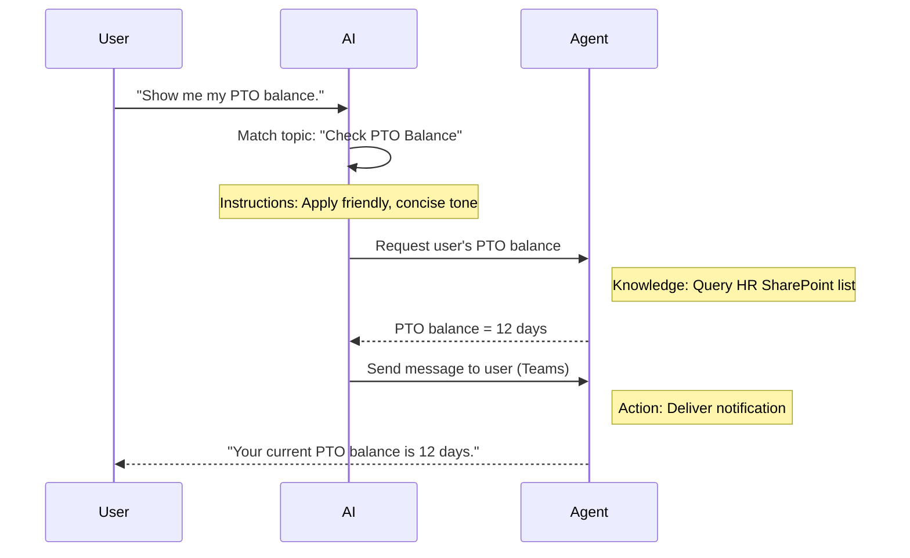

<div class="info-box note" markdown="1">
**Translated article** — This article is based on [Mission 02: Copilot Studio Fundamentals](https://microsoft.github.io/agent-academy/recruit/02-copilot-studio-fundamentals/) from the [Copilot Studio Agent Academy](https://microsoft.github.io/agent-academy/). The original wording takes precedence.
</div>

## Watch the video

- [YouTube walkthrough](https://www.youtube.com/watch?v=x4OCwDRGeLE)

<figure class="screenshot">
  
  <figcaption>Copilot Studio Fundamentals video thumbnail</figcaption>
</figure>

## Mission Briefing

Welcome, Recruit. In this mission, you will learn the core information you need to understand how Copilot Studio works and how to design intelligent agents that deliver real business value.

Before creating your first agent, you need to understand the four core elements that make up every custom AI agent: Knowledge, Tools, Topics, and Instructions. You will also learn how these elements work together inside the Copilot Studio orchestrator.

<div class="info-box note" markdown="1">
**Important — This mission uses the classic Copilot Studio experience**
Microsoft Copilot Studio is gradually rolling out a new authoring experience. The concepts in this mission still apply, but the screenshots and navigation paths in the course are based on the **classic experience**. If your screen looks different in later missions, turn off **New Experience** in the upper-right corner and follow along.
</div>

## Objectives

This mission covers:

1. What Copilot Studio is and when to use it
2. Why organizations build agents for knowledge and automation scenarios
3. How Knowledge, Tools, Topics, and Instructions shape an agent
4. How the Copilot Studio orchestrator makes these components work together

## What is an agent in Copilot Studio?

An **agent** is a specialized AI assistant designed to handle specific work. Unlike a general-purpose chatbot, an agent can:

- Know **company-specific data**, such as policies, documents, and databases  
- **Perform real work**, such as sending messages, creating calendar events, and updating records  
- **Maintain conversation context** and follow up on earlier questions

Copilot Studio is a low-code tool, so you can create agents by dragging and dropping prebuilt components, even without coding experience. When an agent is complete, you can use it in Teams, Slack, custom webpages, and other channels to provide answers or automatically run workflows.

## When and why should you use Copilot Studio?

Microsoft 365 Copilot provides general-purpose AI assistance across Office apps, but custom agents are better suited for cases like these.

### When you need to combine multiple knowledge sources

- M365 Copilot is strong at bringing in context from Microsoft 365, such as SharePoint and Outlook, but an agent is a good choice when you need to search across a broader set of knowledge sources.

### When you want to automate multi-step workflows

- Example: “When someone submits an expense, send an approval request, update the finance tracker, and notify the manager.” A custom agent can handle this kind of multi-step flow from a single command or event.

### When you need a contextual experience that flows naturally inside a tool

- For example, a new-hire onboarding agent in Teams can guide an HR representative through policies, send required forms, and schedule orientation directly inside the collaboration tool they already use.

## The four core components of an agent

Every Copilot Studio agent consists of four core elements:

1. **Knowledge**  
2. **Tools (Actions)**  
3. **Topics**  
4. **Instructions**

Below, we define each element and explain how they work together to create an effective agent.

### 1. Knowledge

**Knowledge** is the data and context an agent uses to answer questions accurately. It has two main parts.

#### Custom instructions and context

- Briefly describe the agent's purpose and tone. For example:

```text
You are an IT support agent. You help employees troubleshoot common software issues, provide troubleshooting steps, and escalate urgent tickets.
```

- During a conversation, the agent remembers previous turns, so it can refer back to what has already been discussed. For example, if the user first says “My printer is offline” and later asks “Did you check the ink level?”, the agent can answer while preserving the printer context.

#### Knowledge sources (grounding data)

- You can connect the agent to multiple data sources, such as SharePoint libraries, documentation sites, wikis, and other databases.  
- When the user asks a question, the agent retrieves relevant content from those sources so its answers are **grounded** in your organization's actual policies, product documentation, and proprietary information.  
- You can even force the agent to answer only from those sources to reduce guesses and hallucinated responses.

<div class="info-box note" markdown="1">
**Example**  
Suppose a “Policy Assistant” agent is connected to an HR SharePoint site. When a user asks “What is our PTO accrual rate?”, the agent can retrieve the exact wording from the HR policy document instead of relying on a generic AI answer.
</div>

### 2. Tools (Actions)

**Tools (Actions)** define what an agent can do beyond simple conversation. Each Action is a unit that programmatically performs work such as:

- Sending an email or Teams message  
- Creating or updating a calendar event  
- Adding or modifying database records, such as SharePoint lists or Dataverse tables  
- Calling a Power Automate flow or REST API

#### How actions work

- **Define inputs and outputs**  
  - For example, a Send Email action might accept the following inputs:  
    - `RecipientEmailAddress`  
    - `SubjectLine`  
    - `EmailBody`

- **Combine actions into workflows**  
  - User requests often require multiple steps.  
  - For example, you might chain actions in this order:  
    1. Retrieve data from a SharePoint list.  
    2. Generate a summary with an LLM.  
    3. Send that summary as a Teams message.

- **Connect to external systems**  
  - If you need to update a CRM or call an internal API, you can create a custom action to handle it.  
  - Copilot Studio can integrate with Power Platform or HTTP-based endpoints.

<div class="info-box note" markdown="1">
**Example**

An “Expense Helper” agent might work like this:

1. Detect a “Submit Expense” request.  
2. Collect the user's expense information from a form.  
3. Save the data with an “Add to SharePoint List” action.  
4. Trigger a “Send Email” action to notify the approver.
</div>

### 3. Topics

**Topics** define an agent's conversation triggers or entry points. Each topic corresponds to a feature or category of questions.

#### Conversational triggers

- For example, you might have topics such as “Submit IT Ticket”, “Check Vacation Balance”, and “Create Sales Report”.  
- Internally, Copilot Studio uses **generative orchestration**. This means it does not rely only on exact keyword matches. Instead, it interprets the user's intent and selects the right topic based on the short description you wrote.

#### Topic descriptions

- Each topic should include a short, clear description of the scope that topic covers.

<div class="info-box note" markdown="1">
**Example topic description**  
This topic helps the user submit an IT support ticket by collecting the issue description, priority, and contact information.
</div>

- Based on this description, the AI decides when to activate the topic even if the user's wording is not an exact match.

#### Connecting topics and actions

- Each topic is connected to one or more actions or data lookup steps.  
- When the AI selects a topic, it guides the conversation and proceeds with the work in the order you defined, such as asking follow-up questions, calling actions, and returning results.

<div class="info-box note" markdown="1">
**Example**  
If a user says “Help me set up a new laptop,” the AI can map that intent to the “Submit IT Ticket” topic. The agent then asks for the laptop model and user information, and automatically creates a ticket in the help desk system.
</div>

### 4. Instructions

**Instructions** (sometimes called “Prompts” or “System Messages”) guide the LLM's tone, style, and boundaries. They define how the agent should respond in any situation.

#### Role and persona

- Tell the agent who it is, such as “You are a customer service agent for Contoso Retail.”  
- This lets you choose the appropriate response style for the situation, such as friendly, concise, or formal.

#### Response guidelines

- Specify rules the agent must follow. For example:  
  - “Always summarize policy information in bullet points.”  
  - “If you do not know the answer, say ‘I'm sorry, but I don't have that information.’”  
  - “Never include confidential data outside the current context.”

#### Memory and context rules

- You can instruct the agent how many turns of conversation to remember.  
- Example: “Remember the details of this user's request for up to three follow-up questions.”

<div class="info-box note" markdown="1">
**Example**  
A “Benefits Advisor” agent might include instructions such as:  
“Always refer to the latest HR handbook when answering questions. If the user asks about enrollment deadlines, provide the exact dates from the policy. Keep responses under 150 words.”
</div>

## How the four core components work together

When you combine **Knowledge**, **Tools**, **Topics**, and **Instructions**, the Copilot Studio AI orchestrator creates an agent that works like this:

1. **Detects the relevant Topic** based on topic descriptions.  
2. **Applies Instructions** to set the tone, decide whether follow-up questions are needed, and enforce rules.  
3. **Uses Knowledge Sources** to ground answers in organizational data.  
4. **Calls Tools (Actions)** to perform work such as sending messages, updating records, or calling APIs.

Internally, the orchestrator uses a **generative planning** approach to determine the steps and order needed to handle the user's request. For example, if sending an email fails, it can ask a follow-up question or report the error based on the exception-handling instructions you defined. The LLM also adapts to conversation context, so it can maintain memory across multiple turns and keep adjusting its responses as new information arrives.

**Visual flow example**



## Mission Complete

You have successfully completed the following.

- **Knowledge**: Identified where agents find factual information.
- **Tools**: Explained how agents perform actions and connect to other systems.
- **Topics**: Explained how agents handle defined conversation paths.
- **Instructions**: Explained how rules, tone, and boundaries guide responses.

Next, continue to [Mission 03: Deploy a declarative agent for Microsoft 365 Copilot]({{ '/en/chapters/academy-recruit-03-create-a-declarative-agent-for-m365copilot/' | relative_url }}).

## Tactical Resources

- [Microsoft Copilot Studio overview](https://learn.microsoft.com/microsoft-copilot-studio/fundamentals-what-is-copilot-studio)
- [Create an agent in Copilot Studio](https://learn.microsoft.com/microsoft-copilot-studio/authoring-first-bot)
